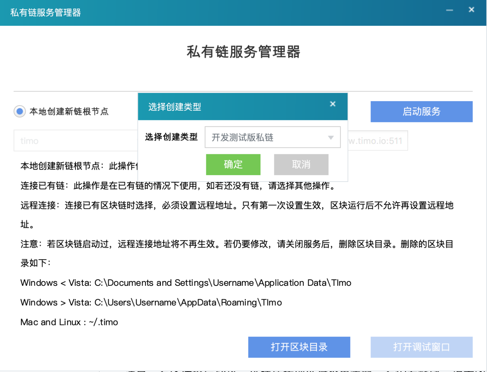
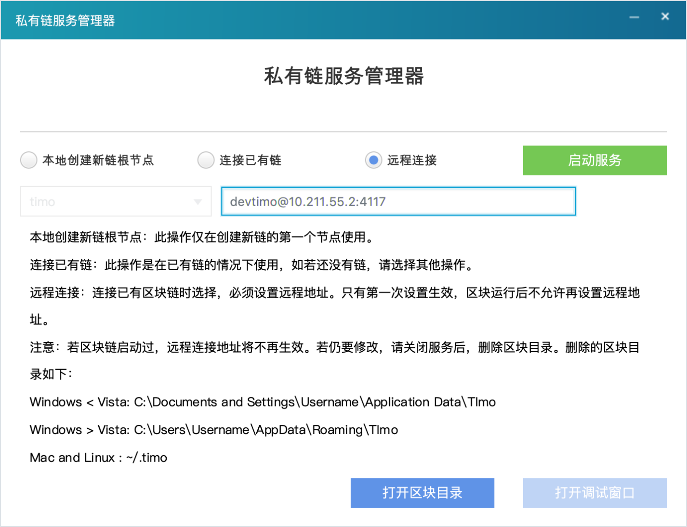

# Timo（Timo Net）开发者文档V1.0

###### created by xia0fan/2018年8月7日

# Timo（Timo Net）介绍

Timo Network （简称:Timo）是一个商业级区块链基础设施；Timo采用创新的双螺旋分子结构，提供智能合约、多链并行、跨链共识、链上大数据模块存储、无感链外碎片化存储、快速应用转移等运行机制，降低传统行业及传统互联网的开发和使用成本，实现区块链商业应用可能。其主要技术特性如下:

* 特性一:底层1080笔/秒交易速度，添加节点与分片，可支持百万笔/秒交易速度。 
* 特性二:快速自由发行数字资产、快速开发Dapp。
* 特性三:完全去中心化原子交易和链上资产交换。
* 特性四:成块时间15秒，单笔数据交易量可达2M，单块可达16M。
* 特性五:独有的数据模块，原生支持场景化智能合约，直接开放链上数据接口，可基于所有已知成熟开发工具自由定制开发Timo Dapp。
* 特性六:支持跨链资产转移与交换，支持链外币种的数据同步，同步后可在Timo Network中直接进行所有币种的交易。
* 特性七:首个商用级别的完全去中心化的类N*RAID5链外应用扩展存储，性能优异，过程无感。
* 特性八:首个线上Dapp软件商店，完善的生态发展体系。

# 准备工作

开发者可以通过Timo测试网络进行开发，也可通过Timo定制开发测试版（技术特性略有差异）进行开发，开发完成后，可与TimoNet联系移植到Timo公链。以下以Timo定制开发测试版为例介绍。

## 下载Timo定制开发测试版

* [下载地址](https://www.timonet.io/developers.html)

## 系统需求

### 软件需求

*	Mac：OS X 10.11+
*	Linux：64位，Debian 7+，Ubuntu 14.04 +，CentOS 7 +，Fedora 20 +，RHEL 7+
*	Windows：64位，Win7+

### 硬件需求

*	内存>1G
*	硬盘>2G

## 安装指南

### 普通用户安装指南

#### Mac安装

		执行Timonet-Wallet-macosx-1.0.1.dmg

#### Windows安装

		在安装包上右键，以管理员身份执行 Timonet-Wallet-win64-1.0.1.exe
		安装完成后，在快捷方式上右键，选择——兼容性——以管理员身份运行此程序

#### Linux DEB包安装 

		sudo dpkg -i Timonet-Wallet-linux64-1.0.1.deb

#### Linux RPM包安装

		sudo rpm -ivh Timonet-Wallet-linux64-1.0.1.rpm

### 开发者安装指南

#### Mac安装

		执行Timonet-PrivateSet-macosx-1.0.1.dmg

#### Windows安装

		在安装包上右键，以管理员身份执行 Timonet-PrivateSet-win64-1.0.1.exe
		安装完成后，在快捷方式上右键，选择——兼容性——以管理员身份运行此程序

#### Linux DEB包安装 

		sudo dpkg -i Timonet-PrivateSet-linux64-1.0.1.deb

#### Linux RPM包安装

		sudo rpm -ivh Timonet-PrivateSet-linux64-1.0.1.rpm

## 基本概念

1. 根节点
一个测试网络建立时的第一个节点，用于初始化安装。根节点建立后，网络中所有节点都可自由连接至根节点。

2. 主节点
根节点及主节点类似于比特币内置的连接节点（比特币有8个内置连接节点），节点建立连接后，根节点或主节点只要不（同时）长时间下线，对整个区块链网络不会产生影响。

3. 普通节点
除根节点/主节点外的节点，其他节点定义为普通节点，节点程序启动后，会自动轮循程序内节点信息试图连接内置节点，与最快的节点建立连接后，会与整个网络的其他节点建立P2P对等连接，一旦建立连接或建立过连接，则整个网络不依赖于某个节点的存在而存在。
以上定义的根节点、主节点、普通节点仅为描述私有链网络的建立先后过程，所有节点一旦建立连接后，彼此在连接上是平等和去中心化的。

## 三步创建开发测试链
1. 创建根节点
通过GUI工具，点击 本地创建新链根节点 启动服务

2. 设置主节点连接
到第二个节点上 点选 远程连接 ，输入根节点 地址 端口号 点击启动服务

3. 设置普通节点
点选 普通节点，输入 根节点/主节点地址 端口号 点击启动
注:开发测试版采用简化连接程序，可仅设置一个根/主节点，直接连接即可开始开发。

经过以上三步，您就建立了一个测试链。便可进行相应的开发工作。

## Timo开发测试版关键参数
描述|定制开发测试版参数 
 :-: | :-: 
区块链名称|devtimo
网络端口|4117
RPC端口|4116
成块时间|30
区块大小|4M
发行资产最大数量|2
发行资产最大值	|100000
发行资产最小单位|0.01
数据模块最大数量|10	
链内应用块单条数据最大值|512K
链外应用块最大值|512M
单一模块数据条目最大数量|100
最大区块数量|10000
连接、发送、接收、创建数据模块、创建资产、挖矿、管理|不限制
多重签名|支持
共识机制|不调整难度的POW-可靠随机
初始产量|10TIM/块
保留代币|10000TIM
减半周期|5000块
单笔最小交易量|不限制
单笔最大交易量	|100000	
链内最小交易费	|0.1TIM/KB
链外数据交易费	|0.01TIM/KB
TIM最小单位|0.01

# 程序开发调用指南

Timo开发测试版私链搭建完成后会在本地自动启动RPC服务，开发人员可以用自己熟悉的一切开发语言通过调用JSON RPC服务方式与链进行交互，开发Dapp。

* JAVA调用:详见

* [JavaSDK](./JavaSDK-doc-v1.0.1-cn.html)

# JSON-RPC API指令集

## JSON-RPC协议概述
    JSON-RPC是基于json的跨语言远程调用协议。比xml-rpc、webservice等基于文本的协议数据传输格小；相对hessian、java-rpc等二进制协议便于调试、实现、扩展，是很优秀的一种远程调用协议。眼下主流语言都已有json-rpc的实现框架。
Timo json-rpc协议很简单。
1. 发起远程调用时向区块链节点传输格式例如以下:

	{ "method": "sayHello", "configs": ["Hello JSON-RPC"], "id": 1}

	参数说明:
		method:调用的方法名
		configs:方法传入的参数。若无参数则传入 []
		id:调用标识符。用于标示一次远程调用过程

2. 区块链节点其收到调用请求，处理方法调用，将方法效用结果效应给调用方；返回数据格式:

	{ "result":"Hello JSON-RPC","error":null,"id":1}                        
	参数说明:
		result:方法返回值。若无返回值。则返回null。
		若调用错误，返回null。
		error:调用时错误，无错误返回null。
		id:调用标识符，与调用方传入的标识符一致。

	以上就是timo json-rpc协议规范，很简单，小巧。便于各种语言实现。

## 命令执行方式
RPC用户名密码存储在~/.timo/devtimo/timo.conf（linux/MAC）或%APPDATA%\TImo\devtimo/timo.conf（Windows）文件中,可以使用timoi命令行工具或者DevtimoGUI工具内置的CLI界面连接，这些工具会自动读取RPC用户名密码并连接至已运行区块链。
* 方式一:单一指令模式
timoi timotest [command] [parameters...]
* 方式二:交互模式（Windows不支持交互模式）
timoi timotest 
[command] [parameters...]

## 可用API指令 

### 区块链查询与控制

#### 指令: help  
* 参数:null/command
* 描述:返回可用命令列表
* JSON RPC实现参考:

发送:

`curl --user timorpc:9cQ5bCjbxxxxxxxxxxxxxxxxxxx2kM --data-binary '{"jsonrpc": "2.0", "id":"rpchelp", "method": "help", "configs": [] }' -H 'content-type: text/plain;' http://127.0.0.1:4116`

返回:	
		
			{
				"result": 
				
					"== CHAIN ==
					showassets
					showbestblockhash
					showblock
					showblockcount
					showblockhash
					showblocks
					showdatas
					showmem
					showpermissions
					showrawmem
					showtips
					showtxout
					showtxoutsetinfo

					== MINE ==
					showmining
					shownethash
					submitblock

					== NET ==
					addnode
					ping
					showallappblockq
					showappblockq
					shownet
					shownode
					showpeer

					== RAWDEALS ==
					addrawchange
					addrawdata
					addrawdeal
					decoderawdeal
					sendrawdeal
					setuprawdeal
					showrawdeal
					signrawdeal

					== TOOL ==
					addcache
					checkmessage
					delcache
					emptymem
					help
					pause
					resume
					setupcache
					setupkeypairs
					setupmulti
					stop
					validaddr

					== WALLET ==
					addmultiaddr
					addnewaddr
					addrawex
					backupwallet
					cancel
					cancelfrom
					completerawex
					decoderawex
					disrawdeal
					dumpprivkey
					dumpwallet
					encryptwallet
					gatherunspent
					importaddr
					importprivkey
					importwallet
					lockunspent
					noorder
					order
					prelockunspent
					prelockunspentfrom
					ratify
					ratifydata
					ratifydatafrom
					ratifyfrom
					sell
					sellasset
					sellassetfrom
					sellfrom
					send
					sendasset
					sendassetfrom
					senddata
					senddatafrom
					sendfrom
					senditem
					senditemfrom
					settxfee
					setupdatamod
					setupdatamodfrom
					setuprawex
					setuprawsendfrom
					showaddrbals
					showaddrdeal
					showaddrdeals
					showaddrs
					showallbals
					showassetdeals
					showbal
					showdatablockitems
					showdataitem
					showdataitems
					showdatakeyitems
					showdatakeys
					showdatakeysumm
					showdatasenderitems
					showdatasenders
					showdatasendersumm
					showdatatxitems
					showdeal
					showlockunspent
					showsinceblock
					showtxoutdata
					showunbal
					showunspent
					showwalletdeal
					showwalletdeals
					signmessage
					walletlock", 
				"error": null, 
				"id": "rpchelp"
			}
#### 指令: stop
* 参数:null
* 描述:停止区块链运行
* JSON RPC实现参考:
		
发送:
		
`curl --user timorpc:9cQ5bCjbxxxxxxxxxxxxxxxxxxx2kM --data-binary '{"jsonrpc": "2.0", "id":"rpcstop", "method": "stop", "configs": [] }' -H 'content-type: text/plain;' http://127.0.0.1:4116`		
		
返回:
			
			{
				"result": "TImo server stopping", 
				"error": null, 
				"id": "rpcstop"
			}		 
#### 指令: pause
* 参数:mining|incoming
* 描述:暂停区块链，mining incoming共同使用时以逗号分隔
* JSON RPC实现参考:

发送:

`curl --user timorpc:9cQ5bCjbxxxxxxxxxxxxxxxxxxx2kM --data-binary '{"jsonrpc": "2.0", "id":"rpcpause", "method": "pause", "configs": ["mining,incoming"]}' -H 'content-type: text/plain;' http://127.0.0.1:4116`		

返回:

			{
				"result":"Paused",
				"error":null,
				"id":"rpcpause"
			 }
#### 指令: resume
* 参数:mining|incoming
* 描述:恢复区块链，与pause配合使用，mining incoming共同使用时以逗号分隔
* JSON RPC实现参考:
		
发送:

`curl --user timorpc:9cQ5bCjbxxxxxxxxxxxxxxxxxxx2kM --data-binary '{"jsonrpc": "2.0", "id":"rpcresume", "method": "resume", "configs": ["mining,incoming"] }' -H 'content-type: text/plain;' http://127.0.0.1:4116`		
		
返回:
			
			{
				"result":"Resumed",
				"error":null,
				"id":"rpresume"
			 }
#### 指令: emptymem
* 参数:null
* 描述:清空内存池，删除该节点内存中未确认的事务
* JSON RPC实现参考:
		
发送:

`curl --user timorpc:9cQ5bCjbxxxxxxxxxxxxxxxxxxx2kM --data-binary '{"jsonrpc": "2.0", "id":"rpcemptymem", "method": "emptymem", "configs": [] }' -H 'content-type: text/plain;' http://127.0.0.1:4116`		
		
返回:
			
			{
				"result":"Mempool emptied",
				"error":null,
				"id":"rpcemptymem"
			 }
#### 指令: showmem
* 参数:null
* 描述:返回内存池信息
* JSON RPC实现参考:
		
发送:

`curl --user timorpc:9cQ5bCjbxxxxxxxxxxxxxxxxxxx2kM --data-binary '{"jsonrpc": "2.0", "id":"rpcshowmem", "method": "showmem", "configs": [] }' -H 'content-type: text/plain;' http://127.0.0.1:4116`
		
返回:
			
			{
				"result":{"size":0,"bytes":0},
				"error":null,
				"id":"rpcshowmem"
			 }
#### 指令: addnode
* 参数:1）ip(:port) 2）command
* 描述:手动添加或删除点对点连接1.例:192.168.1.18:4117 2.add|remove|onetry
* JSON RPC实现参考:	
		
发送:

`curl --user timorpc:9cQ5bCjbxxxxxxxxxxxxxxxxxxx2kM --data-binary '{"jsonrpc": "2.0", "id":"rpcaddnode", "method": "addnode", "configs": ["192.168.1.18:6171", "onetry"] }' -H 'content-type: text/plain;' http://127.0.0.1:4116`

返回:
			
			{
				"result":null,
				"error":null,
				"id":"rpcaddnode"
			}
#### 指令: shownode
* 参数:1）true|false 2）(ip(:port))
* 描述:1）true=返回关于使用addnode添加节点的信息，false=返回使用addnode添加节点的列表2）包含或省略ip(:port)的节点
* JSON RPC实现参考:
		
发送:

`curl --user timorpc:9cQ5bCjbxxxxxxxxxxxxxxxxxxx2kM --data-binary '{"jsonrpc": "2.0", "id":"rpcshownode", "method": "shownode", "configs": [true] }' -H 'content-type: text/plain;' http://127.0.0.1:4116`

返回:

			{
				"result": 
					[
						{
							"addednode": "10.211.55.38:4117", 
							"connected": true, 
							"addresses": 
								[
									{
										"address": "10.21.55.38:4117", 
										"connected": "outbound"
									}
								]
						}
					], 
				"error": null, 
				"id": "rpcshownode"
			 }
#### 指令: shownet		
* 参数:null
* 描述:返回连接的网络IP及端口信息	
* JSON RPC实现参考:
		
发送: 

`curl --user timorpc:9cQ5bCjbxxxxxxxxxxxxxxxxxxx2kM --data-binary '{"jsonrpc": "2.0", "id":"rpcshownet", "method": "shownet", "configs": [] }' -H 'content-type: text/plain;' http://127.0.0.1:4116`

返回: 

			{
			  "result": 
				{
					"version": 100000, 
					"subversion": "/TImo:0.2.0.3/", 
					"ProVer": 70002, 
					"localservices": "0000000000000001", 
					"timeoffset": 0, 
					"connections": 1, 
					"networks": 
						[
						  {
							"name": "ipv4", 
							"limited": false, 
							"reachable": true, 
							"proxy": ""
						  }, 
						  {
							"name": "ipv6", 
							"limited": false, 
							"reachable": true, 
							"proxy": ""
						  }, 
						  {
							"name": "onion", 
							"limited": false, 
							"reachable": false, 
							"proxy": ""
						  }
						], 
					"relayfee": 0.1, 
					"localaddresses": 
						[
						  {
							"address": "10.211.55.36", 
							"port": 4117, 
							"score": 3
						  }, 
						  {
							"address": "fdb2:2c26:f4e4:0:21c:42ff:fe4d:83e9", 
							"port": 4117, 
							"score": 1
						  }, 
						  {
							"address": "fe80::21c:42ff:fe4d:83e9", 
							"port": 4117, 
							"score": 1
						  }
						]
				}, 
			  "error": null, 
			  "id": "rpcshownet"
			}
#### 指令: showpeer
* 参数:null
* 描述:返回连接到的其他节点的信息
* JSON RPC实现参考:

发送:

`curl --user timorpc:9cQ5bCjbxxxxxxxxxxxxxxxxxxx2kM --data-binary '{"jsonrpc": "2.0", "id":"rpcshowpeer", "method": "showpeer", "configs": [] }' -H 'content-type: text/plain;' http://127.0.0.1:4116`

返回:

			{
			  "result": [
				{
				  "id": 2, 
				  "addr": "10.211.55.38:43188", 
				  "addrlocal": "10.211.55.36:4117", 
				  "services": "0000000000000001", 
				  "lastsend": 1533530684, 
				  "lastrecv": 1533530684, 
				  "bytessent": 13711, 
				  "bytesrecv": 12688, 
				  "conntime": 1533530190, 
				  "pingtime": 0.056358, 
				  "version": 70002, 
				  "subver": "/TImo:0.2.0.3/", 
				  "handlocal": null, 
				  "handshake": null, 
				  "inbound": true, 
				  "startingheight": 0, 
				  "banscore": 0, 
				  "synced_headers": 19, 
				  "synced_blocks": 19, 
				  "inflight": [ ], 
				  "whitelisted": false
				}
			  ], 
			  "error": null, 
			  "id": "rpcshowpeer"
			}
#### 指令: showchain
* 参数:null
* 描述:显示链信息	
* JSON RPC实现参考:
		
发送:

`curl --user timorpc:9cQ5bCjbxxxxxxxxxxxxxxxxxxx2kM --data-binary '{"jsonrpc": "2.0", "id":"rpcshowchain", "method": "showchain", "configs": [] }' -H 'content-type: text/plain;' http://127.0.0.1:4116`
		
返回:

			{
			  "result": {
				"blocks": 22, 
				"headers": 22, 
				"bestblockhash": "00589d80160800f1bf0e8435217148882ba58b8cc8811370c80054ce517f3597"
			  }, 
			  "error": null, 
			  "id": "rpcshowchain"
			}
#### 指令: showblock	
* 参数:1）hash|height 2）可选:0|1|2|3|4
* 描述:查看指定hash|height的区块信息，可选参数0:以原始十六进制格式的块，1（默认）:包含miner地址和txids列表的块摘要，2|3:包括每笔交易和其原始十六进制的更多信息，4:包含每个事务的完整描述
* JSON RPC实现参考:

发送:

`curl --user timorpc:9cQ5bCjbxxxxxxxxxxxxxxxxxxx2kM --data-binary '{"jsonrpc": "2.0", "id":"rpcshowblock", "method": "showblock", "configs": ["10"] }' -H 'content-type: text/plain;' http://127.0.0.1:4116`

返回:

			{
			  "result": {
				"hash": "0061f06e6551d10110f2226f447154d9fe013c6e9a20d7d7e4e3a154251ff35e", 
				"miner": "1RK2Xo56Xn6DJznefCy3x4zKbQYQauHZzA8YAz", 
				"confirmations": 16, 
				"size": 299, 
				"height": 10, 
				"version": 3, 
				"merkleroot": "751737b927e83c606d3772bfeeef8b5df1a8fca19af9d1a97f57a178eb79616f", 
				"tx": [
				  "751737b927e83c606d3772bfeeef8b5df1a8fca19af9d1a97f57a178eb79616f"
				], 
				"time": 1533530397, 
				"nonce": 3, 
				"bits": "2000ffff", 
				"difficulty": 5.96046447753906e-8, 
				"chainwork": "0000000000000000000000000000000000000000000000000000000000000b00", 
				"prevblockhash": "00af1ba6fe08cfacec1165eb20a77e38a6cf4f49026538f2d1ca5a482f036a01", 
				"nextblockhash": "00a24afc1b1f6edfd061f17416269cdf1385cc2d7dc568cb2399d04240265023"
			  }, 
			  "error": null, 
			  "id": "rpcshowblock"
			}
#### 指令: showblocks	
* 参数:1）blocks 2）可选:true|false，默认=true	
* 描述:返回有关指定块的信息1）:string|array|object  string:heigt|hash|height   array:jason array  object   2)true|false	
* JSON RPC实现参考:
	
发送:

`curl --user timorpc:9cQ5bCjbxxxxxxxxxxxxxxxxxxx2kM --data-binary '{"jsonrpc": "2.0", "id":"rpcshowblocks", "method": "showblocks", "configs": ["10"] }' -H 'content-type: text/plain;' http://127.0.0.1:4116`

返回:

			{
			  "result": [
				{
				  "hash": "0061f06e6551d10110f2226f447154d9fe013c6e9a20d7d7e4e3a154251ff35e", 
				  "miner": "1RK2Xo56Xn6DJznefCy3x4zKbQYQauHZzA8YAz", 
				  "confirmations": 21, 
				  "height": 10, 
				  "time": 1533530397, 
				  "txcount": 1
				}
			  ], 
			  "error": null, 
			  "id": "rpcshowblocks"
			}
#### 指令: showblockhash	
* 参数:height	
* 描述:返回给定高度块的HASH值	
* JSON RPC实现参考:

发送:

`curl --user timorpc:9cQ5bCjbxxxxxxxxxxxxxxxxxxx2kM --data-binary '{"jsonrpc": "2.0", "id":"rpcshowblockhash", "method": "showblockhash", "configs": [10] }' -H 'content-type: text/plain;' http://127.0.0.1:4116`

返回:

			{
			  "result": "0061f06e6551d10110f2226f447154d9fe013c6e9a20d7d7e4e3a154251ff35e", 
			  "error": null, 
			  "id": "rpcshowblockhash"
			}
#### 指令: signmessage	
* 参数:1）address|privkey 2）message	 	
* 描述:消息签名
* JSON RPC实现参考:

发送:

`curl --user timorpc:9cQ5bCjbxxxxxxxxxxxxxxxxxxx2kM --data-binary '{"jsonrpc": "2.0", "id":"rpcsignmessage", "method": "signmessage", "configs": ["18AMhQBLUpZffkXq2zRLz3yqDLKKaWNPfYFs1N","hello,world"] }' -H 'content-type: text/plain;' http://127.0.0.1:4116`

返回:

			{
			  "result": "IFxTfW603Rh6X2Oa0PrNmBvWhjIxT1HHjabrAxhLXn7OC4A5/TmBnpD2bfyUFrHm31K/CyBOr5caQ/B9KHjPj8c=", 
			  "error": null, 
			  "id": "rpcsignmessage"
			}
### 管理钱包地址密钥

#### 指令: addnewaddr		
* 参数:null
* 描述:返回私钥添加到钱包的新地址。	
* JSON 实现参考:
		
发送:

`curl --user timorpc:9cQ5bCjbxxxxxxxxxxxxxxxxxxx2kM --data-binary '{"jsonrpc": "2.0", "id":"rpcaddnewaddr", "method": "addnewaddr", "configs": [] }' -H 'content-type: text/plain;' http://127.0.0.1:4116`		

返回:

			{
			  "result": "1YzFG4en2nWE6YSmXDwd3R2N3kxhXhuJapjhuC", 
			  "error": null, 
			  "id": "rpcaddnewaddr"
			}
#### 指令: addmultiaddr	
* 参数:1.num. 2.["PUBKEY1", ...]
* 描述:创建多签地址并将其添加到钱包
* JSON RPC实现参考:
		发送:curl --user timorpc:9cQ5bCjbxxxxxxxxxxxxxxxxxxx2kM --data-binary '{"jsonrpc": "2.0", "id":"rpcaddmultiaddr", "method": "addmultiaddr", "configs": [2, ["03174c6e52f7da9046a5d09ae5562d2df0exxxxxxxdae195c723c7aa","0298102aab3caf958xxxxxxxxxx771b507cf2335be6f3fc8daf1da108cef6b07"]] }' -H 'content-type: text/plain;' http://127.0.0.1:4116
		返回:
			{
			  "result": "4QT4CkHKm5eKc3FeVwJHaaMf6PMJ2hMnsbBBLz", 
			  "error": null, 
			  "id": "rpcaddmultiaddr"
			}
#### 指令: setupmulti
* 参数:1.num. 2.["PUBKEY1", ...]
* 描述:创建多签地址但不加入钱包	
* JSON RPC实现参考:
		
发送:

`curl --user timorpc:9cQ5bCjbxxxxxxxxxxxxxxxxxxx2kM --data-binary '{"jsonrpc": "2.0", "id":"rpcsetupmulti", "method": "setupmulti", "configs": [2, ["03174c6e52f7da9046a5d09ae5562d2df0exxxxxxxdae195c723c7aa","0298102aab3caf958xxxxxxxxxx771b507cf2335be6f3fc8daf1da108cef6b07"]] }' -H 'content-type: text/plain;' http://127.0.0.1:4116`

返回:

			{
			  "result":
			  {
				"address":"4QT4CkHKm5eKc3FeVwJHaaMf6PMJ2hMnsbBBLz",
				"redeemScript":"522103174c6e52f7da9046a5d09ae5562d2df0e729172b14fef69a51dae195c723c7aa210298102aab3caf958614ee7f83b04771b507cf2335be6f3fc8daf1da108cef6b0752ae"
			  },
			  "error":null,
			  "id":"rpcsetupmulti"
			}
#### 指令: setupkeypairs	
* 参数:可选num.
* 描述:生成一个或多个公钥/私钥对，默认1	
* JSON RPC实现参考:

发送:

`curl --user timorpc:9cQ5bCjbxxxxxxxxxxxxxxxxxxx2kM --data-binary '{"jsonrpc": "2.0", "id":"rpcsetupkeypairs", "method": "setupkeypairs", "configs": [2] }' -H 'content-type: text/plain;' http://127.0.0.1:4116`		

返回:
			
			{
				"result":[
					{
						"address":"1TMu81kr2fjq2JfDF9Xt75m8aNDp5mAAmBHPdx",
						"pubkey":"03569587b7971902bdd75018c10e33454fxxxxxxxxd9d1a26d736",
						"privkey":"VCs4opJ4MPxKxxxxxxxxrpDFTb5v2k5Dy8ziNP9k9FhCm3d3"
					},
					{
						"address":"164zASaqJpfBz6bdNrXHX7qbHpmuimyavuQw1m",
						"pubkey":"033878015bdxxxxxxxxxx1fa854bec0ebb7bccfc89ac0fcd253dc0395f75",
						"privkey":"V7jNsRaBNjMxxxxxxxxxjUJmKvoshJU1Mo5fdSVq7Qwo3axxg1JF"
					}
				],
				"error":null,
				"id":"rpcsetupkeypairs"
			}
#### 指令: showaddrs
* 参数:null		
* 描述:返回此节点钱包中的地址详细信息
* JSON RPC实现参考:

发送:

`curl --user timorpc:9cQ5bCjbxxxxxxxxxxxxxxxxxxx2kM --data-binary '{"jsonrpc": "2.0", "id":"rpcshowaddrs", "method": "showaddrs", "configs": [] }' -H 'content-type: text/plain;' http://127.0.0.1:4116`
		
返回:

			{
				"result":[
					{
						"address":"18AMhQBLUpZffkXq2zRLz3yqDLKKaWNPfYFs1N",
						"ismine":true,
						"iswatchonly":false,
						"isscript":false,
						"pubkey":"02998a9ba30ed924d8c36xxxxxxxx66ba9b23211914d0a239a525e05a859f",
						"iscompressed":true,
						"synchronized":true
					},
					{
						"address":"1YzFG4en2nWE6YSmXDwd3R2N3kxhXhuJapjhuC",
						"ismine":true,
						"iswatchonly":false,
						"isscript":false,
						"pubkey":"03174c6e52f7da9046axxxxxxxxx172b14fef69a51dae195c723c7aa",
						"iscompressed":true,
						"synchronized":true
					},
					{
						"address":"4QT4CkHKm5eKc3FeVwJHaaMf6PMJ2hMnsbBBLz",
						"ismine":false,
						"iswatchonly":true,
						"isscript":true,
						"script":"multisig",
						"hex":"522103174c6e5xxxxxxxxx5562d2df0e729172b14fef69a51dae195c723c7aa210298102aab3caf958614ee7f83b04771b507cf2335be6f3fc8daf1da108cef6b0752ae",
						"addresses":[
							"1YzFG4en2nWE6YSmXDwd3R2N3kxhXhuJapjhuC",
							"1RK2Xo56Xn6DJznefCy3x4zKbQYQauHZzA8YAz"
						],
						"sigsrequired":2,
						"synchronized":false,
						"startblock":59
					}
				],
				"error":null,
				"id":"rpcshowaddrs"
			}
#### 指令: dumpprivkey	
* 参数:address	 
* 描述:导出address的私钥	
* JSON RPC实现参考:
		
发送:

`curl --user timorpc:9cQ5bCjbxxxxxxxxxxxxxxxxxxx2kM --data-binary '{"jsonrpc": "2.0", "id":"curltest", "method": "dumpprivkey", "configs": ["1YzFG4en2nWE6YSmXDwd3R2N3kxhXhuJapjhuC"] }' -H 'content-type: text/plain;' http://127.0.0.1:4116`		

返回:
			
			{
				"result":"VBRQkxxxxxxxxxxxxxxxxxWC82kZ9Ct41f",
				"error":null,
				"id":"curltest"
			}
#### 指令: importprivkey
* 参数:1）[privkey1,privkey2,…] 2）可选:label
* 描述:导入私钥（或其数组）添加到钱包，生成相关的地址	
* JSON RPC实现参考:
		
发送:

`curl --user timorpc:9cQ5bCjbxxxxxxxxxxxxxxxxxxx2kM --data-binary '{"jsonrpc": "2.0", "id":"rpcimportprivkey", "method": "importprivkey", "configs":["VCs4opJ4MPxKfgUxxxxxxxxxxxxDy8ziNP9k9FhCm3d3"] }' -H 'content-type: text/plain;' http://127.0.0.1:4116`		

返回:
	
			{
				"result":null,
				"error":null,
				"id":"rpcimportprivkey"
			}
#### 指令: importaddr
* 参数:address(es)	
* 描述:将address 添加到钱包中(无私钥),创建一个或多个只读账户
* JSON RPC实现参考:
		
发送:

`curl --user timorpc:9cQ5bCjbxxxxxxxxxxxxxxxxxxx2kM --data-binary '{"jsonrpc": "2.0", "id":"rpcmimportaddr", "method": "importaddr", "configs": ["1YzFG4en2nWE6YSmXDwd3R2N3kxhXhuJapjhuC "] }' -H 'content-type: text/plain;' http://127.0.0.1:4116`
		
返回:

			{
				"result":null,
				"error":null,
				"id":"rpcmimportaddr"
			}
#### 指令: backupwallet
* 参数:路径	
* 描述:备份wallet.dat钱包文件
* JSON RPC实现参考:

发送:

`curl --user timorpc:9cQ5bCjbxxxxxxxxxxxxxxxxxxx2kM --data-binary '{"jsonrpc": "2.0", "id":"rpcbackupwallet", "method": "backupwallet", "configs": ["/home/username/"] }' -H 'content-type: text/plain;' http://127.0.0.1:4116`
		
返回:

			{
				"result":null,
				"error":null,
				"id":"rpcbackupwallet"
			}
#### 指令: dumpwallet
* 参数: filename 
* 描述: 将钱包中的全部私钥转储为文本文件 * JSON RPC实现参考:

发送: 

`curl --user timorpc:9cQ5bCjbxxxxxxxxxxxxxxxxxxx2kM --data-binary '{"jsonrpc": "2.0", "id":"rpcdumpwallet", "method": "dumpwallet", "configs": ["/home/username/dump.txt"] }' -H 'content-type:text/plain;'http://127.0.0.1:4116`
		
返回: 

			{
				"result": null,
				"error": null,
				"id": "rpcdumpwallet"
			}
#### 指令: importwallet
* 参数: filename 
* 描述: 导入钱包文本文件， 此指令只能导入dumpwallet导出的文本文件 
* JSON RPC实现参考:

发送: 

`curl --user timorpc:9cQ5bCjbxxxxxxxxxxxxxxxxxxx2kM --data-binary '{"jsonrpc": "2.0", "id":"rpcimportwallet", "method": "importwallet", "configs": ["/home/username/dump.txt"] }' -H 'content-type:text/plain;'http://127.0.0.1:4116`
		
返回: 

			{
				"result": null,
				"error": null,
				"id": "rpcimportwallet"
			}
#### 指令: encryptwallet
* 参数: password 
* 描述: 首次加密节点的钱包， 使用password作为解锁密码 
* JSON RPC实现参考:

发送: 

`curl --user timorpc:9cQ5bCjbxxxxxxxxxxxxxxxxxxx2kM --data-binary '{"jsonrpc": "2.0", "id":"rpcencryptwallet", "method": "encryptwallet", "configs": ["password"] }' -H 'content-type: text/plain;'http://127.0.0.1:4116`
    
返回: 

		{
			"result": "wallet encrypted; server stopping, restart to run with encrypted wallet. The keypool has been flushed, you need to make a new backup.",
			"error": null,
			"id": "rpcencryptwallet"
		}
#### 指令: changepass
* 参数: 1） old - password 2） new - password 
* 描述: 更改钱包密码 
* JSON RPC实现参考:

发送: 

`curl --user timorpc:9cQ5bCjbxxxxxxxxxxxxxxxxxxx2kM --data-binary '{"jsonrpc": "2.0", "id":"rpcchangepass", "method": "changepass", "configs": ["password","newpassword"] }' -H 'content-type: text/plain;'http://127.0.0.1:4116`
		
返回: 

			{
				"result": null,
				"error": null,
				"id": "rpcchangepass"
			}
#### 指令: walletpass
* 参数: 1） password 2） time 
* 描述: 使用password解锁节点的钱包, 在time时间内有效。 
* JSON RPC实现参考:
		
发送: 

`curl --user timorpc:9cQ5bCjbxxxxxxxxxxxxxxxxxxx2kM --data-binary '{"jsonrpc": "2.0", "id":"rpcwalletpass", "method": "walletpass", "configs": ["newpassword",3600] }' -H 'content-type: text/plain;'http://127.0.0.1:4116`
		
返回: 

			{
				"result": null,
				"error": null,
				"id": "rpcwalletpass"
			}

#### 指令: showassets
* 参数: 1） 可选资产， 默认 = * 2） 可选: false | true， 默认 = true 3） 可选: 数量 4） 可选: 起始数量 
* 描述: 返回链中已发行的资产的信息 
* JSON RPC实现参考:

发送: 

`curl --user timorpc:9cQ5bCjbxxxxxxxxxxxxxxxxxxx2kM --data-binary '{"jsonrpc": "2.0", "id":"rpcshowassets", "method": "showassets", "configs": [] }' -H 'content-type: text/plain;'http://127.0.0.1:4116`

返回: 

			{
				"result": [],
				"error": null,
				"id": "rpcshowassets"
			}

#### 指令: showaddrbals
* 参数: 1） address 2） 可选: 最小确认3） 可选: false | true 
* 描述: 返回此账户节点钱包中所有资产余额的列表 1） 账户 2） 最小确认数量 3） 默认false不包含锁定 
* JSON RPC实现参考:
		
发送:
 
`curl --user timorpc:9cQ5bCjbxxxxxxxxxxxxxxxxxxx2kM --data-binary '{"jsonrpc": "2.0", "id":"rpcshowaddrbals", "method": "showaddrbals", "configs": ["18AMhQBLUpZffkXq2zRLz3yqDLKKaWNPfYFs1N"] }' -H 'content-type: text/plain;'http://127.0.0.1:4116`

返回: 

			{
				"result": [{
					"assetref": "",
					"qty": 10652.74,
					"raw": 1065274
				}],
				"error": null,
				"id": "rpcshowaddrbals"
			}
#### 指令: showallbals
* 参数: 1） 可选addresses， 默认 = * 2） 可选assets， 默认 = * 3） 可选最小确认， 默认 = 14） 可选: false | true， 默认 = false 5） 可选: false | true， 默认 = false 
* 描述: 返回addresses指定的此节点钱包中的余额列表(包含原生货币)（ 1） 地址（ 2） 资产（ 3） 最小确认（ 4） false不包含只读账户（ 5） false不包含锁定 
* JSON RPC实现参考:

发送: 

`curl --user timorpc:9cQ5bCjbxxxxxxxxxxxxxxxxxxx2kM --data-binary '{"jsonrpc": "2.0", "id":"rpcshowallbals", "method": "showallbals", "configs": [] }' -H 'content-type: text/plain;'http://127.0.0.1:4116`		

返回: 
			
			{
				"result": {
					"18AMhQBLUpZffkXq2zRLz3yqDLKKaWNPfYFs1N": [{
						"assetref": "",
						"qty": 10662.74,
						"raw": 1066274
					}],
					"total": [{
						"assetref": "",
						"qty": 10662.74,
						"raw": 1066274
					}]
				},
				"error": null,
				"id": "rpcshowallbals"
			}
#### 指令: showaddrdeal
* 参数: 1） address 2） txid 
* 描述: 输出address txid相关交易的信息 
* JSON RPC实现参考:
		
发送: 

`curl --user timorpc:9cQ5bCjbxxxxxxxxxxxxxxxxxxx2kM --data-binary '{"jsonrpc": "2.0", "id":"rpcshowaddrdeal", "method": "showaddrdeal", "configs": ["18AMhQBLUpZffkXq2zRLz3yqDLKKaWNPfYFs1N", "ca92c5d8f3c39f00ffeb8e64b2ace39a9bf81ff51cdcd56c3445d55f3e698601"] }' -H 'content-type: text/plain;'http://127.0.0.1:4116`		

返回: 

			{
				"result": {
					"balance": {
						"amount": -18.03,
						"assets": []
					},
					"myaddresses": ["18AMhQBLUpZffkXq2zRLz3yqDLKKaWNPfYFs1N"],
					"addresses": ["1RK2Xo56Xn6DJznefCy3x4zKbQYQauHZzA8YAz"],
					"permissions": [],
					"items": [],
					"data": [],
					"confirmations": 1,
					"blockhash": "00c85b0a065be280b05db048094a60f2e02f1f9ec0022736648d8f85682554ef",
					"blockindex": 1,
					"blocktime": 1533534890,
					"txid": "ca92c5d8f3c39f00ffeb8e64b2ace39a9bf81ff51cdcd56c3445d55f3e698601",
					"valid": true,
					"time": 1533534863,
					"timereceived": 1533534863,
					"vin": [{
						"txid": "0eacf0bfb6afcf5d28c85bf923a330e878545605e2fd2924ed939da49370b254",
						"vout": 0,
						"addresses": ["18AMhQBLUpZffkXq2zRLz3yqDLKKaWNPfYFs1N"],
						"type": "pubkeyhash",
						"ismine": true,
						"iswatchonly": false,
						"amount": 10
					}, {
						"txid": "f08f7f91b8f362c87c12c878434edd12d77623b647ed966555286a6cdfc7ae43",
						"vout": 0,
						"addresses": ["18AMhQBLUpZffkXq2zRLz3yqDLKKaWNPfYFs1N"],
						"type": "pubkeyhash",
						"ismine": true,
						"iswatchonly": false,
						"amount": 10
					}],
					"vout": [{
						"n": 0,
						"addresses": ["1RK2Xo56Xn6DJznefCy3x4zKbQYQauHZzA8YAz"],
						"type": "pubkeyhash",
						"ismine": false,
						"iswatchonly": false,
						"amount": 18
					}, {
						"n": 1,
						"addresses": ["18AMhQBLUpZffkXq2zRLz3yqDLKKaWNPfYFs1N"],
						"type": "pubkeyhash",
						"ismine": true,
						"iswatchonly": false,
						"amount": 1.97
					}],
					"hex": "010000000254b27093a49d93ed2429fde205565478e830a323f95bc8285dcfafb6bff0ac0e000000006a47304402207865aee2f15beeaa77aae3d63bcfa4e7c00701ba24b8f9260061be878b8317f80220669d42a40865ff764dc194c82b43a5627594d977aa11c109d899e6d7c2ab0272012102998a9ba30ed924d8c36cbc70d78ddbd466ba9b23211914d0a239a525e05a859fffffffff43aec7df6c6a28556596ed47b62376d712dd4e4378c8127cc862f3b8917f8ff0000000006b4830450221008bb77d97a1009659b4fe543d76fdc3d30468ba333c4ab7129a1f658ccbfb9bbd02201028863f6bb5e8ad67eeceb3e80c92414b6a2f9dcb1c4d1b872840f1cd11a867012102998a9ba30ed924d8c36cbc70d78ddbd466ba9b23211914d0a239a525e05a859fffffffff0208070000000000001976a914b3dfb19e2f5ed073f5b4f615b44a6df763ae571388acc5000000000000001976a91434fc71bb74878181225231f0a1597eabe060321588ac00000000"
				},
				"error": null,
				"id": "rpcshowaddrdeal"
			}
#### 指令: showaddrdeals
* 参数: 1） "address" 2） 可选: 数量， 默认 = 10 3） 可选: 排除， 默认 = 0 4） 可选: false | true， 默认 = false 
* 描述: 返回此账户地址的交易信息（ 1） 地址（ 2） 返回交易数量（ 3） 排除（ 4） true 详细信息 
* JSON RPC实现参考:

发送: 

`curl --user timorpc:9cQ5bCjbxxxxxxxxxxxxxxxxxxx2kM --data-binary '{"jsonrpc": "2.0", "id":"rpcshowaddrdeals", "method": "showaddrdeals", "configs": ["18AMhQBLUpZffkXq2zRLz3yqDLKKaWNPfYFs1N", 1, 10] }' - H 'content-type: text/plain;'http: //127.0.0.1:4116`
		
返回: 

			{
				"result": [{
					"balance": {
						"amount": 10,
						"assets": []
					},
					"myaddresses": ["18AMhQBLUpZffkXq2zRLz3yqDLKKaWNPfYFs1N"],
					"addresses": [],
					"permissions": [],
					"items": [],
					"data": ["53504b62473045022100e4a8f157022c64801b92a966717f393831688de5d306fd3f3759245d23553be802205f6c9a843efa0b67a419c8742762659ec6eb50f0d8db0c34f52dad13c2395152022102998a9ba30ed924d8c36cbc70d78ddbd466ba9b23211914d0a239a525e05a859f"],
					"confirmations": -1,
					"generated": true,
					"txid": "51e71d2f8ee280208ce18a1590fcc1a71f496dfa3135ec4d39a62a1a6e80467a",
					"valid": false,
					"time": 1533534532,
					"timereceived": 1533534532
				}],
				"error": null,
				"id": "rpcshowaddrdeals"
			}
#### 指令: showwalletdeal
* 参数: 1） TXID 2） 可选: false | true 3） 可选false | true 
* 描述: 提供有关txid此节点钱包中的交易的信息（ 1） TXID（ 2） 默认false不包含只读账户地址（ 3） 默认false不包含详细信息 
* JSON RPC实现参考:

发送: 

`curl --user timorpc:9cQ5bCjbxxxxxxxxxxxxxxxxxxx2kM --data-binary '{"jsonrpc": "2.0", "id":"rpcshowwalletdeal", "method": "showwalletdeal", "configs": ["ca92c5d8f3c39f00ffeb8e64b2ace39a9bf81ff51cdcd56c3445d55f3e698601"] }' -H 'content-type: text/plain;'http://127.0.0.1:4116`
		
返回: 

			{
				"result": {
					"balance": {
						"amount": -18.03,
						"assets": []
					},
					"myaddresses": ["18AMhQBLUpZffkXq2zRLz3yqDLKKaWNPfYFs1N"],
					"addresses": ["1RK2Xo56Xn6DJznefCy3x4zKbQYQauHZzA8YAz"],
					"permissions": [],
					"items": [],
					"data": [],
					"confirmations": 10,
					"blockhash": "00c85b0a065be280b05db048094a60f2e02f1f9ec0022736648d8f85682554ef",
					"blockindex": 1,
					"blocktime": 1533534890,
					"txid": "ca92c5d8f3c39f00ffeb8e64b2ace39a9bf81ff51cdcd56c3445d55f3e698601",
					"valid": true,
					"time": 1533534863,
					"timereceived": 1533534863
				},
				"error": null,
				"id": "rpcshowwalletdeal"
			}
#### 指令: showwalletdeals
* 参数: 1） 可选: 数量， 默认 = 10 2） 可选排除， 默认 = 0 3） 可选: false | true， 默认 = false 
* 描述: 显示有关count此节点钱包中最近事务的信息。（ 1） 数量（ 2） 排除（ 3） false不包含只读账户地址 
* JSON RPC实现参考:

发送: 

`curl --user timorpc:9cQ5bCjbxxxxxxxxxxxxxxxxxxx2kM --data-binary '{"jsonrpc": "2.0", "id":"rcpshowwalletdeals", "method": "showwalletdeals", "configs": [1, 10] }' -H 'content-type: text/plain;'http://127.0.0.1:4116`

返回: 

			{
				"result": [{
					"balance": {
						"amount": 10,
						"assets": []
					},
					"myaddresses": ["18AMhQBLUpZffkXq2zRLz3yqDLKKaWNPfYFs1N"],
					"addresses": [],
					"permissions": [],
					"items": [],
					"data": ["53504b62473045022100d93f08c782cdac61adc22e4e00ea449039fcffb59d861e1aafe9f1d10cd8336602203cb9df84d9bfa0a70861c737fbc95ae1563bded2818125dac538ed869be5e24a022102998a9ba30ed924d8c36cbc70d78ddbd466ba9b23211914d0a239a525e05a859f"],
					"confirmations": 48,
					"generated": true,
					"blockhash": "008206d657bad6bc567d35a98b71b379bdbf51626233595f92a6e563574ac261",
					"blockindex": 0,
					"blocktime": 1533537579,
					"txid": "13b87ebcfe7f5727aa25ca605f0a3b0714b0e3c93d29fb6f4ecfc4a8ad888c63",
					"valid": true,
					"time": 1533537579,
					"timereceived": 1533537579,
					"vin": [{
						"n": -1,
						"addresses": [],
						"type": "nonstandard",
						"ismine": false,
						"iswatchonly": false,
						"amount": -0.01
					}],
					"vout": [{
						"n": 0,
						"addresses": ["18AMhQBLUpZffkXq2zRLz3yqDLKKaWNPfYFs1N"],
						"type": "pubkeyhash",
						"ismine": true,
						"iswatchonly": false,
						"amount": 10
					}, {
						"n": 1,
						"addresses": [],
						"type": "nulldata",
						"ismine": false,
						"iswatchonly": false,
						"amount": 0,
						"data": ["53504b62473045022100d93f08c782cdac61adc22e4e00ea449039fcffb59d861e1aafe9f1d10cd8336602203cb9df84d9bfa0a70861c737fbc95ae1563bded2818125dac538ed869be5e24a022102998a9ba30ed924d8c36cbc70d78ddbd466ba9b23211914d0a239a525e05a859f"]
					}],
					"hex": "01000000010000000000000000000000000000000000000000000000000000000000000000ffffffff0c02f8000101062f503253482fffffffff02e8030000000000001976a91434fc71bb74878181225231f0a1597eabe060321588ac0000000000000000726a4c6f53504b62473045022100d93f08c782cdac61adc22e4e00ea449039fcffb59d861e1aafe9f1d10cd8336602203cb9df84d9bfa0a70861c737fbc95ae1563bded2818125dac538ed869be5e24a022102998a9ba30ed924d8c36cbc70d78ddbd466ba9b23211914d0a239a525e05a859f00000000"
				}],
				"error": null,
				"id": "rpcshowwalletdeals"
			}	
#### 指令: showassetdeal
* 参数: 1） assetid 2） txid 3） boolean 
* 描述: 根据资产id与txid查询交易详情 
* JSON RPC实现参考:
		
发送:

`curl --user timorpc:cQ5bCjbxxxxxxxxxxxxxxxxxxx2kM --data-binary '{"jsonrpc": "2.0", "id":"rpcshowassetdeal", "method": "showassetdeal", "configs": ["ETH","ffefff12c966d3c70036d5e28618116cbb39822bddc95e20157a431ec93eb319",true] }' -H 'content-type: text/plain;'http://127.0.0.1:4116 `
		
返回: 

			{
				"result": {
					"addresses": {
						"1Hu44T3agUHecCFHKfArrP1G5QjNYgKcPu": 0
					},
					"items": [],
					"data": [],
					"confirmations": 22,
					"blockhash": "00796883cb4826d3c6628151ee7fa93559c1dee6d5a5de7de9dcd15dca3d0714",
					"blockindex": 1,
					"blocktime": 1537963069,
					"txid": "196367a784f55cab104d9bb74ecbb318c142296917d1af0075dd516fff4e0a77",
					"valid": true,
					"time": 1537963043,
					"timereceived": 1537963043,
					"vin": [{
						"txid": "349fe0193a0dfaaf6d0b49f421d496b4a63d442b02f89a6a25438d38eb221ee2",
						"vout": 2,
						"addresses": ["1Hu44T3agUHecCFHKfArrP1G5QjNYgKcPu"],
						"type": "pubkeyhash",
						"ismine": true,
						"iswatchonly": false,
						"amount": 0,
						"assets": [{
							"name": "JPY",
							"assetref": "226-300-62639",
							"qty": 1000
						}]
					}, {
						"txid": "58d6bd818a16ad1cecdab5c73806c23710b023ea404c2cccfa741b1fdeecbe8e",
						"vout": 1,
						"addresses": ["1Hu44T3agUHecCFHKfArrP1G5QjNYgKcPu"],
						"type": "pubkeyhash",
						"ismine": true,
						"iswatchonly": false,
						"amount": 1000003682.02
					}],
					"vout": [{
						"n": 0,
						"addresses": ["12CwFvogMGrC98eA1gCGTw89bG2CPmN1Tw"],
						"type": "pubkeyhash",
						"ismine": false,
						"iswatchonly": true,
						"amount": 2000,
						"permissions": [{
							"for": null,
							"connect": false,
							"send": true,
							"receive": false,
							"create": false,
							"sell": false,
							"mine": false,
							"root": false,
							"admin": false,
							"startblock": 0,
							"endblock": 4294967295,
							"timestamp": 1537963043
						}]
					}, {
						"n": 1,
						"addresses": ["1Hu44T3agUHecCFHKfArrP1G5QjNYgKcPu"],
						"type": "pubkeyhash",
						"ismine": true,
						"iswatchonly": false,
						"amount": 0,
						"assets": [{
							"name": "JPY",
							"assetref": "226-300-62639",
							"qty": 1000,
							"type": "transfer"
						}]
					}, {
						"n": 2,
						"addresses": ["1Hu44T3agUHecCFHKfArrP1G5QjNYgKcPu"],
						"type": "pubkeyhash",
						"ismine": true,
						"iswatchonly": false,
						"amount": 1000001681.56
					}],
					"hex": "0100000002e21e22eb388d43256a9af8022b443da6b496d421f4490b6daffa0d3a19e09f34020000006b4830450221009ed45c13712e613836a34af0a41a60c403cacf2ca1cb617370457472f1d8acda022034e34d3cdddae696d791e27ab1f8899de09fcbe634c02e40db72666bbdc6421b012102bf77975f581ac99b1e22dce58f2b5f05beb3b8d3ad52be687ad56b41a6745c72ffffffff8ebeecde1f1b74facc2c4c40ea23b01037c20638c7b5daec1cad168a81bdd658010000006a47304402207461060c5dc63135b18ff3ec83d7708fbc9de97304f47682dbcdec32dbb54b0f0220275d2016754898eaf0e26ef500c148fba8eda74c09c3d69e1e2e8a2c2df7ac7c012102bf77975f581ac99b1e22dce58f2b5f05beb3b8d3ad52be687ad56b41a6745c72ffffffff03400d0300000000002f76a9140d39fe3e4bd85f02e8d56087574d68035289030788ac1473706b700200000000000000ffffffff2374ab5b7500000000000000003776a914b95a324bae5f6bf551766f61e82cb172b13161f288ac1c73706b7150d303023230534d81b64cda5061f4afa08601000000000075dc787948170000001976a914b95a324bae5f6bf551766f61e82cb172b13161f288ac00000000"
				},
				"error": null,
				"id": "rpcshowassetdeal"
			}
#### 指令: showassetdeals
* 参数: 1） assetid 2） count 3） start 4） Boolean true以钱包数据排序， false以链顺序排序 
* 描述: 查询特定资产的交易信息。 节点需提前order资产 
* JSON RPC实现参考:

发送: 

`curl --user timorpc:cQ5bCjbxxxxxxxxxxxxxxxxxxx2kM --data-binary '{"jsonrpc": "2.0", "id":"rpcshowassetdeals", "method": "showassetdeals", "configs": ["JPY","196367a784f55cab104d9bb74ecbb318c142296917d1af0075dd516fff4e0a77",true] }' -H 'content-type: text/plain;'http://127.0.0.1:4116`
		
返回: 

			{
				"result": [{
					"addresses": {
						"1Hu44T3agUHecCFHKfArrP1G5QjNYgKcPu": 0
					},
					"items": [],
					"data": [],
					"confirmations": 22,
					"blockhash": "00796883cb4826d3c6628151ee7fa93559c1dee6d5a5de7de9dcd15dca3d0714",
					"blockindex": 1,
					"blocktime": 1537963069,
					"txid": "196367a784f55cab104d9bb74ecbb318c142296917d1af0075dd516fff4e0a77",
					"valid": true,
					"time": 1537963043,
					"timereceived": 1537963043,
					"vin": [{
						"txid": "349fe0193a0dfaaf6d0b49f421d496b4a63d442b02f89a6a25438d38eb221ee2",
						"vout": 2,
						"addresses": ["1Hu44T3agUHecCFHKfArrP1G5QjNYgKcPu"],
						"type": "pubkeyhash",
						"ismine": true,
						"iswatchonly": false,
						"amount": 0,
						"assets": [{
							"name": "JPY",
							"assetref": "226-300-62639",
							"qty": 1000
						}]
					}, {
						"txid": "58d6bd818a16ad1cecdab5c73806c23710b023ea404c2cccfa741b1fdeecbe8e",
						"vout": 1,
						"addresses": ["1Hu44T3agUHecCFHKfArrP1G5QjNYgKcPu"],
						"type": "pubkeyhash",
						"ismine": true,
						"iswatchonly": false,
						"amount": 1000003682.02
					}],
					"vout": [{
						"n": 0,
						"addresses": ["12CwFvogMGrC98eA1gCGTw89bG2CPmN1Tw"],
						"type": "pubkeyhash",
						"ismine": false,
						"iswatchonly": true,
						"amount": 2000,
						"permissions": [{
							"for": null,
							"connect": false,
							"send": true,
							"receive": false,
							"create": false,
							"sell": false,
							"mine": false,
							"root": false,
							"admin": false,
							"startblock": 0,
							"endblock": 4294967295,
							"timestamp": 1537963043
						}]
					}, {
						"n": 1,
						"addresses": ["1Hu44T3agUHecCFHKfArrP1G5QjNYgKcPu"],
						"type": "pubkeyhash",
						"ismine": true,
						"iswatchonly": false,
						"amount": 0,
						"assets": [{
							"name": "JPY",
							"assetref": "226-300-62639",
							"qty": 1000,
							"type": "transfer"
						}]
					}, {
						"n": 2,
						"addresses": ["1Hu44T3agUHecCFHKfArrP1G5QjNYgKcPu"],
						"type": "pubkeyhash",
						"ismine": true,
						"iswatchonly": false,
						"amount": 1000001681.56
					}],
					"hex": "0100000002e21e22eb388d43256a9af8022b443da6b496d421f4490b6daffa0d3a19e09f34020000006b4830450221009ed45c13712e613836a34af0a41a60c403cacf2ca1cb617370457472f1d8acda022034e34d3cdddae696d791e27ab1f8899de09fcbe634c02e40db72666bbdc6421b012102bf77975f581ac99b1e22dce58f2b5f05beb3b8d3ad52be687ad56b41a6745c72ffffffff8ebeecde1f1b74facc2c4c40ea23b01037c20638c7b5daec1cad168a81bdd658010000006a47304402207461060c5dc63135b18ff3ec83d7708fbc9de97304f47682dbcdec32dbb54b0f0220275d2016754898eaf0e26ef500c148fba8eda74c09c3d69e1e2e8a2c2df7ac7c012102bf77975f581ac99b1e22dce58f2b5f05beb3b8d3ad52be687ad56b41a6745c72ffffffff03400d0300000000002f76a9140d39fe3e4bd85f02e8d56087574d68035289030788ac1473706b700200000000000000ffffffff2374ab5b7500000000000000003776a914b95a324bae5f6bf551766f61e82cb172b13161f288ac1c73706b7150d303023230534d81b64cda5061f4afa08601000000000075dc787948170000001976a914b95a324bae5f6bf551766f61e82cb172b13161f288ac00000000"
				}],
				"error": null,
				"id": "rpcshowassetdeals"
			}
#### 指令: send
* 参数: 1） address 2） 数量 3） 可选: 附加信息 4） 可选: 附加信息归属 
* 描述: 发送一个或多个资产（ 可以是原生资产） 到address， 返回TXID 1） 地址 2） {"asset": qty,...}，资产名称， 每个对象qty是发送的资产数量 3） 附加信息 4） 附加信息归属
* JSON RPC实现参考:
		
发送: 

`curl --user timorpc:9cQ5bCjbxxxxxxxxxxxxxxxxxxx2kM --data-binary '{"jsonrpc": "2.0", "id":"rpcsend", "method": "send", "configs": ["164zASaqJpfBz6bdNrXHX7qbHpmuimyavuQw1m",{"TOC":1000,"":2000}] }' -H 'content-type: text/plain;'http://127.0.0.1:4116`

返回: 

			{
				"result": "e395151d1db6e5629d8e4903559f0809746c7b350f0017e8cfc6f60b18a846f7",
				"error": null,
				"id": "rpcsend"
			}
##### 指令: sendfrom
* 参数: 1） from - address 2） to - address 3） 数量 4） 可选: 附加信息 5） 可选: 附加信息归属 
* 描述: 同send， 通过from - address操作。 
* JSON RPC实现参考:

发送: 

`curl --user timorpc:9cQ5bCjbxxxxxxxxxxxxxxxxxxx2kM  --data-binary '{"jsonrpc": "2.0", "id":"rpcsendfrom", "method": "sendfrom", "configs": ["18AMhQBLUpZffkXq2zRLz3yqDLKKaWNPfYFs1N","164zASaqJpfBz6bdNrXHX7qbHpmuimyavuQw1m",1] }' -H 'content-type: text/plain;'http://127.0.0.1:4116`
		
返回: 

			{
				"result": "1b27777e582c3f8ab0d912bb07d02fee6c8fe91160ff0183a1abc6e2219da209",
				"error": null,
				"id": "rpcsendfrom"
			}
#### 指令: sendasset
* 参数: 1） address 2） 资产名称 3） 数量 4） 可选: 矿工手续费 5） 可选: 附加信息 6） 可选: 附加信息归属 
* 描述: 发送一定数量的资产到指定地址， 返回TXID。 
* JSON RPC参考:
		
发送: 

`curl --user timorpc:9cQ5bCjbxxxxxxxxxxxxxxxxxxx2kM --data-binary '{"jsonrpc": "2.0", "id":"rpcsendasset", "method": "sendasset", "configs": ["164zASaqJpfBz6bdNrXHX7qbHpmuimyavuQw1m", "TOC", 1000] }' -H 'content-type: text/plain;'http://127.0.0.1:4116`
		
返回: 

			{
				"result": "87988ebb4ba152d9eacd595acfe934b2104e1cefdbddb7895cf43df905927270",
				"error": null,
				"id": "rpcsendasset"
			}

#### 指令: sendassetfrom
* 参数: 1） from - address 2） to - address 3） 资产名称 4） 数量5） 可选: 矿工手续费6） 可选: 附加信息7） 可选: 附加信息归属 
* 描述: 类似sendasset， 通过from - address操作 
* JSON RPC实现参考:

发送: 

`curl --user timorpc:9cQ5bCjbxxxxxxxxxxxxxxxxxxx2kM --data-binary '{"jsonrpc": "2.0", "id":"rpcsendassetfrom", "method": "sendassetfrom", "configs": ["18AMhQBLUpZffkXq2zRLz3yqDLKKaWNPfYFs1N","164zASaqJpfBz6bdNrXHX7qbHpmuimyavuQw1m", "TOC",1] }' -H 'content-type: text/plain;'http://127.0.0.1:4116`

返回: 

			{
				"result": "5e9c6d1be2807c0bdcc990e1d5df5dbe63d154ac5b95dd4c3a857364f5521eca",
				"error": null,
				"id": "rpcsendassetfrom"
			}
#### 指令: senddata
* 参数: 1） address 2） 原生货币数量 | 对象 3） 十六进制数据 | 对象 
* 描述: 类似send， 附加数据事务 1） 地址 2） 原生货币数量 | {"asset-id": qty}3） data - hex | {"for": datamod,"key": "...","data": "..."} 
* JSON RPC实现参考:

发送: 

`curl --user timorpc:9cQ5bCjbxxxxxxxxxxxxxxxxxxx2kM --data-binary '{"jsonrpc": "2.0", "id":"rpcsenddata", "method": "senddata", "configs": ["164zASaqJpfBz6bdNrXHX7qbHpmuimyavuQw1m", 0.1, "5e9c6d1be2807c0bdcc990e1d5df5dbe63d154ac5b95dd4c3a857364f5521eca"] }' - H 'content-type: text/plain;'http://127.0.0.1:4116`

返回: 

			{
				"result": "a6fc00cd7e0ebb23cba98e3a5568a4dc1048abc087b5079ca55fbd45bdae710f",
				"error": null,
				"id": "rpcsenddata"
			}
#### 指令: senddatafrom
* 参数: 1） from - address 2） to - address 3） 原生货币数量 | 对象 4） 十六进制数据 | 对象 
* 描述: 类似senddata， 通过from - address操作 
* JSON RPC实现参考:

发送: 

`curl --user timorpc:9cQ5bCjbxxxxxxxxxxxxxxxxxxx2kM --data-binary '{"jsonrpc": "2.0", "id":"rpcsenddatafrom", "method": "senddatafrom", "configs": ["18AMhQBLUpZffkXq2zRLz3yqDLKKaWNPfYFs1N","164zASaqJpfBz6bdNrXHX7qbHpmuimyavuQw1m", 0.1, "a6fc00cd7e0ebb23cba98e3a5568a4dc1048abc087b5079ca55fbd45bdae710f"] }' -H 'content-type: text/plain;'http://127.0.0.1:4116`
		
返回: 

			{
				"result": "21576deaa1e52544670ee826eba60ec16a98e85e10c80d0bd32fc2b44e2aec72",
				"error": null,
				"id": "rpcsenddatafrom"
			}
#### 指令: validaddr
* 参数: 1) address 1) pubkey 1) privatekey
* 描述: 校验地址是否正确 
* JSON RPC实现参考:

发送: 

`curl --user timorpc:cQ5bCjbxxxxxxxxxxxxxxxxxxx2kM --data-binary '{"jsonrpc": "2.0", "id":"rpcvalidaddr", "method": "validaddr", "configs": ["11HGiMrQocKZAdSuPgJoMAckLV9bDQR7S"] }' -H 'content-type: text/plain;'http://127.0.0.1:4116	`

返回: 

			{
				"result": {
					"isvalid": true,
					"address": "11HGiMrQocKZAdSuPgJoMAckLV9bDQR7S",
					"ismine": true,
					"iswatchonly": false,
					"isscript": false,
					"pubkey": "028a112726406c5b7a3bbe3cdf5c0c65b1900dc9550a3452d3b2036b63e7d490de",
					"iscompressed": true,
					"synchronized": true
				},
				"error": null,
				"id": "rpcvalicaddr"
			}
### 创建发行数字资产/数据模块指令

#### 指令: sell	
* 参数:1）address 2）名字|资产配置 3）数量 4）可选最小单位:默认=1 5）可选:手续费默认=最低 6）可选:自定义信息
* 描述:向地址发行一定数量的资产。1）向address发行2）名称或对象{"name":"asset1","open":true}，true代表可追加发行 3）数量 4）最小的可交易单位如0.1 5）手续费 6）自定义信息
* JSON RPC实现参考:
		
发送:

`curl --user timorpc:9cQ5bCjbxxxxxxxxxxxxxxxxxxx2kM --data-binary '{"jsonrpc": "2.0", "id":"rpcsell", "method": "sell", "configs": ["18AMhQBLUpZffkXq2zRLz3yqDLKKaWNPfYFs1N ", {"name":"AOC","open":true}, 500, 0.01, 0.01] }' -H 'content-type: text/plain;' http://127.0.0.1:4116`

返回:

			{
				"result": "db51c2c5192d4f6b5dd14fb400ee212b9e9b1d9a42ce1410c546ac225256dedc",
				"error": null,
				"id": "rpcsell"
			}
#### 指令: sellfrom
* 参数:1）from-address  2）to-address 3）名字|资产配置  4）数量 5）可选最小单位:默认=1 6）可选:手续费默认=最低 7）可选:自定义信息
* 描述:同sell，通过特定地址from-address操作
* JSON RPC实现参考:

发送:

`curl --user timorpc:9cQ5bCjbxxxxxxxxxxxxxxxxxxx2kM --data-binary '{"jsonrpc": "2.0", "id":"rpcsellfrom", "method": "sellfrom", "configs": ["18AMhQBLUpZffkXq2zRLz3yqDLKKaWNPfYFs1N","164zASaqJpfBz6bdNrXHX7qbHpmuimyavuQw1m", "ZOC" , 1000, 0.01, 0.01] }' -H 'content-type: text/plain;' http://127.0.0.1:4116`

返回:

			{
				"result":"682da8869ec5e8f73c9047468bfb78f753e73bc8fd667d475287910f0395ada5",
				"error":null,
				"id":"rpcsellfrom"
			}
#### 指令: sellasset	
* 参数:1）address 2）已有资产3）追加数量4）可选:手续费默认=最低 5）可选:自定义信息
* 描述:向指定地址追加发行一定数量的资产。（1）地址（2）已有资产（3）追加数量（4）手续费（5）自定义信息
* JSON RPC实现参考:

发送:

`curl --user timorpc:9cQ5bCjbxxxxxxxxxxxxxxxxxxx2kM --data-binary '{"jsonrpc": "2.0", "id":"rpcsellasset", "method": "sellasset", "configs": ["164zASaqJpfBz6bdNrXHX7qbHpmuimyavuQw1m", "AOC", 1000, 0.01] }' -H 'content-type: text/plain;' http://127.0.0.1:4116`
		
返回:
			
			{
				"result":"e4bd2c85216a4fedcf1f0e83e6211c6b50b0bf6b18cd925c93d6e11f3bf22934",
				"error":null,
				"id":"rpcsellasset"
			}
#### 指令: sellassetfrom	
* 参数:1）from-address 2）to-addressasset 3）已有资产 4）追加数量 5）可选:手续费默认=最低 6）可选:自定义信息
* 描述:同sellasset，通过特定地址from-address操作	
* JSON RPC实现参考: 

发送:

`curl --user timorpc:9cQ5bCjbxxxxxxxxxxxxxxxxxxx2kM --data-binary '{"jsonrpc": "2.0", "id":"rpcsellassetfrom", "method": "sellassetfrom", "configs": ["18AMhQBLUpZffkXq2zRLz3yqDLKKaWNPfYFs1N","164zASaqJpfBz6bdNrXHX7qbHpmuimyavuQw1m", "AOC", 1000, 0.01] }' -H 'content-type: text/plain;' http://127.0.0.1:4116`

返回:

			{
				"result":"ee0da0ba6ec9268953d2c9cea549a9b27c8909b6a5e9677235825bafc8c75966",
				"error":null,
				"id":"rpcsellassetfrom"
			}
#### 指令: setupdatamod	
* 参数: 1）名称  2）true|false 3）可选:自定义信息
* 描述:创建数据模块（1）名称（2）true则任何人都可以发布到数据模块，false 创建者可以发布（3）可选:自定义信息
* JSON RPC 实现参考:

发送:

`curl --user timorpc:9cQ5bCjbxxxxxxxxxxxxxxxxxxx2kM --data-binary '{"jsonrpc": "2.0", "id":"rpcsetupdatamod", "method": "setupdatamod", "configs": ["DM01", true] }' -H 'content-type: text/plain;' http://127.0.0.1:4116`

返回:

			{
				"result":"3fd02780979dc668d4b80a851178c751a8537309a42920b65daae4781033c380",
				"error":null,
				"id":"rpcsetupdatamod"
			}
#### 指令: setupdatamodfrom	
* 参数: 1）from-address 2）名称 3）true|false 4）可选:自定义信息
* 描述:同setupdatamod，通过from-address操作
* JSON RPC实现参考:

发送:

`curl --user timorpc:9cQ5bCjbxxxxxxxxxxxxxxxxxxx2kM --data-binary '{"jsonrpc": "2.0", "id":"rpcsetupdatamodfrom", "method": "setupdatamodfrom", "configs": ["18AMhQBLUpZffkXq2zRLz3yqDLKKaWNPfYFs1N", "DM02", false] }' -H 'content-type: text/plain;' http://127.0.0.1:4116`

返回:

			{
				"result":"81bef0741e932549d14e150f277359ad6732d02420f2c69e03a9f9592a307bb8",
				"error":null,
				"id":"rpcsetupdatamodfrom"
			}
#### 指令: senditem
* 参数:（1）数据模块名称（2）关键字/关键字数组 （3）数据
* 描述:向数据模块里写数据 1）数据模块名称2）文本形式关键字或者数组3）十六进制数据或JSON对象或文本
* JSON RPC实现参考:
		
发送:

`curl --user timorpc:9cQ5bCjbxxxxxxxxxxxxxxxxxxx2kM --data-binary '{"jsonrpc": "2.0", "id":"rpcsenditem", "method": "senditem", "configs": ["DM01", "key01", "81bef0741e932549d14e150f277359ad6732d02420f2c69e03a9f9592a307bb8"] }' -H 'content-type: text/plain;' http://127.0.0.1:4116`

返回:

			{
				"result":"1818882cff70fa4f0489b1df53811e445bc73a58386ffe55a3a0b9c2e8e179bd",
				"error":null,
				"id":"rpcsenditem"
			}
#### 指令: senditemfrom	
* 参数:1）from-address 2）数据模块名称 3）关键字/关键字数组 4）数据
* 描述:同senditem，通过from-address 操作
* JSON RPC实现参考:

发送:

`curl --user timorpc:9cQ5bCjbxxxxxxxxxxxxxxxxxxx2kM --data-binary '{"jsonrpc": "2.0", "id":"rpcsenditemfrom", "method": "senditemfrom", "configs": ["18AMhQBLUpZffkXq2zRLz3yqDLKKaWNPfYFs1N", "DM01", "key02", "1818882cff70fa4f0489b1df53811e445bc73a58386ffe55a3a0b9c2e8e179bd "] }' -H 'content-type: text/plain;' http://127.0.0.1:4116`
		
返回:

			{
				"result":null,
				"error":{
					"code":-15,
					"message":"data should be hexadecimal string or recognized object"
				},
				"id":"rpcsenditemfrom"
			}
#### 指令: showdatas	
* 参数:1）可选数据模块名称默认=* 2）可选:false|true，默认=false 3）可选:数量，默认=最大数量 4）可选:开始值，默认=最新	
* 描述:返回有关在区块链上创建的数据模块的信息。1）数据模块名称 2）rue 返回创建地址，默认为false 3）数量 4）起始
* JSON RPC实现参考:

发送:

`curl --user timorpc:9cQ5bCjbxxxxxxxxxxxxxxxxxxx2kM --data-binary '{"jsonrpc": "2.0", "id":"rpcshowdatas", "method": "showdatas", "configs": [] }' -H 'content-type: text/plain;' http://127.0.0.1:4116`

返回:

			{
				"result":[
					{
						"name":"devroot",
						"setuptxid":"b53791e4f4299a001d04337a9ef041104e5578e7270dc74e25265f1def28c2f3",
						"datamodref":"0-0-0",
						"restrict":{
							"write":false,
							"inchain":false,
							"outchain":false
						},
						"details":{

						},
						"ordered":true,
						"synchronized":true,
						"items":0,
						"confirmed":0,
						"keys":0,
						"senditemers":0
					},
					{
						"name":"DM01",
						"setuptxid":"3fd02780979dc668d4b80a851178c751a8537309a42920b65daae4781033c380",
						"datamodref":"357-300-53311",
						"restrict":{
							"write":false,
							"inchain":false,
							"outchain":false
						},
						"details":{

						},
						"ordered":false
					},
					{
						"name":"DM02",
						"setuptxid":"81bef0741e932549d14e150f277359ad6732d02420f2c69e03a9f9592a307bb8",
						"datamodref":"360-300-48769",
						"restrict":{
							"write":true,
							"inchain":false,
							"outchain":false
						},
						"details":{

						},
						"ordered":false
					}
				],
				"error":null,
				"id":"rpcshowdatas"
			}
#### 指令: order	
* 参数:1）一个或多个资产|一个或多个数据模块2）可选:true|false，默认=true
* 描述:订购资产或数据模块，要求节点开始跟踪一个或多个资产或数据模块 1）一个或多个资产|一个或多个数据模块 2）是否重新扫描，true代表重新扫描
* JSON RPC实现参考: 

发送:

`curl --user timorpc:9cQ5bCjbxxxxxxxxxxxxxxxxxxx2kM --data-binary '{"jsonrpc": "2.0", "id":"rpcorder", "method": "order", "configs": ["DM01", true] }' -H 'content-type: text/plain;' http://127.0.0.1:4116`

返回:

			{
				"result":null,
				"error":null,
				"id":"rpcorder"
			}
#### 指令: noorder
* 参数:一个或多个资产|一个或多个数据模块	
* 描述:取消订购资产或数据模块，要求节点停止跟踪一个或多个资产或数据模块
* JSON RPC实现参考:

发送:

`curl --user timorpc:9cQ5bCjbxxxxxxxxxxxxxxxxxxx2kM --data-binary '{"jsonrpc": "2.0", "id":"rpcnoorder", "method": "noorder", "configs": ["DM01"] }' -H 'content-type: text/plain;' http://127.0.0.1:4116`

返回:

			{
				"result":null,
				"error":null,
				"id":"rpcnoorder"
			}
#### 指令: showdataitem
* 参数: 1）数据模块名称 2）TXID 3）可选:false|true，默认=false	
* 描述:通过TXID检索数据模块条目（1）数据模块名称（2）TXID（3）默认false不显示数据，true显示数据
* JSON参考实现:

发送:

`curl --user timorpc:9cQ5bCjbxxxxxxxxxxxxxxxxxxx2kM --data-binary '{"jsonrpc": "2.0", "id":"rpcshowdataitem", "method": "showdataitem", "configs": ["DM01", "1818882cff70fa4f0489b1df53811e445bc73a58386ffe55a3a0b9c2e8e179bd"] }' -H 'content-type: text/plain;' http://127.0.0.1:4116`		

返回:
		
			{
				"result":{
					"senditemers":[
						"164zASaqJpfBz6bdNrXHX7qbHpmuimyavuQw1m"
					],
					"keys":[
						"key01"
					],
					"outchain":false,
					"available":true,
					"data":"81bef0741e932549d14e150f277359ad6732d02420f2c69e03a9f9592a307bb8",
					"confirmations":18,
					"blocktime":1533542011,
					"txid":"1818882cff70fa4f0489b1df53811e445bc73a58386ffe55a3a0b9c2e8e179bd"
				},
				"error":null,
				"id":"rpcshowdataitem"
			}
#### 指令: showdataitems
* 参数:1）数据模块名称2）可选:条目数量，默认=10 3）可选:开始条目 4）可选:false|true，默认=false
* 描述:显示datamodID对应的条目 1）数据模块名称（2）条数（3）从哪条开始（4）false钱包中（右旋链），true区块中（左旋链）。
* JSON RPC实现参考:

发送:

`curl --user timorpc:9cQ5bCjbxxxxxxxxxxxxxxxxxxx2kM --data-binary '{"jsonrpc": "2.0", "id":"rpcshowdataitems", "method": "showdataitems", "configs": ["DM01", 20] }' -H 'content-type: text/plain;' http://127.0.0.1:4116`		

返回:
		
			{
				"result":[
					{
						"senditemers":[
							"164zASaqJpfBz6bdNrXHX7qbHpmuimyavuQw1m"
						],
						"keys":[
							"key01"
						],
						"outchain":false,
						"available":true,
						"data":"81bef0741e932549d14e150f277359ad6732d02420f2c69e03a9f9592a307bb8",
						"confirmations":12,
						"blockhash":"00ea4dfccb5bd2418140a170679a54de5d7123f75dfdcdbfa4d5d826084380cc",
						"blockindex":1,
						"blocktime":1533542011,
						"txid":"1818882cff70fa4f0489b1df53811e445bc73a58386ffe55a3a0b9c2e8e179bd",
						"vout":0,
						"valid":true,
						"time":1533541989,
						"timereceived":1533541989
					}
				],
				"error":null,
				"id":"rpcshowdataitems"
			}
#### 指令: showdatakeys	
* 参数: 1）数据模块名称 2）可选:关键字|关键字数组，默认=* 3）可选:数量，默认=最大值 4）可选:开始数量 5）可选:false|true，默认=true
* 描述:显示数据模块的关键字信息 1）数据模块名称 2）关键字|关键字数组 3）条数 4）从哪条开始 5）false钱包中（右旋链），true区块中（左旋链）
* JSON RPC实现参考:

发送:

`curl --user timorpc:9cQ5bCjbxxxxxxxxxxxxxxxxxxx2kM --data-binary '{"jsonrpc": "2.0", "id":"rpcshowdatakeys", "method": "showdatakeys", "configs": ["DM01", "key01"] }' -H 'content-type: text/plain;' http://127.0.0.1:4116`
		
返回:

			{
				"result":[
					{
						"key":"key01",
						"items":1,
						"confirmed":1
					}
				],
				"error":null,
				"id":"rpcshowdatakeys"
			}
#### 指令: showdatakeyitems	
* 参数: 1）数据模块名称 2）关键字 3）可选:条目数量 4）可选:开始条目 5）可选:false|true，默认=false
* 描述:列出给定的项目关键字的数据条目内容信息 1）数据模块名称 2）关键字 3）条数 4）从哪条开始 5）false钱包中（右旋链），true区块中（左旋链）
* JSON RPC实现参考:

发送:

`curl --user timorpc:9cQ5bCjbxxxxxxxxxxxxxxxxxxx2kM --data-binary '{"jsonrpc": "2.0", "id":"rpcshowdatakeyitems", "method": "showdatakeyitems", "configs": ["DM01", "key01", 20] }' -H 'content-type: text/plain;' http://127.0.0.1:4116`

返回:

			{
				"result":[
					{
						"senditemers":[
							"164zASaqJpfBz6bdNrXHX7qbHpmuimyavuQw1m"
						],
						"keys":[
							"key01"
						],
						"outchain":false,
						"available":true,
						"data":"81bef0741e932549d14e150f277359ad6732d02420f2c69e03a9f9592a307bb8",
						"confirmations":21,
						"blockhash":"00ea4dfccb5bd2418140a170679a54de5d7123f75dfdcdbfa4d5d826084380cc",
						"blockindex":1,
						"blocktime":1533542011,
						"txid":"1818882cff70fa4f0489b1df53811e445bc73a58386ffe55a3a0b9c2e8e179bd",
						"vout":0,
						"valid":true,
						"time":1533541989,
						"timereceived":1533541989
					}
				],
				"error":null,
				"id":"rpcshowdatakeyitems"
			}
#### 指令: showdatasenderitems	
* 参数:1）数据模块名称 2）地址 3）可选:false|true，默认=false 4）可选:条目数量 5）可选:开始条目 6）可选false|true，默认=false
* 描述:列出给出的制定发送者地址的数据条目 1）数据模块名称 2）发送者地址 3）true显示详细信息 4）条数5）从哪条开始 6）false钱包中（右旋链），true区块中（左旋链）
* JSON RPC实现参考:

发送:

`curl --user timorpc:9cQ5bCjbxxxxxxxxxxxxxxxxxxx2kM --data-binary '{"jsonrpc": "2.0", "id":"rpcshowdatasenderitems", "method": "showdatasenderitems", "configs": ["DM01", "18AMhQBLUpZffkXq2zRLz3yqDLKKaWNPfYFs1N ", false, 20] }' -H 'content-type: text/plain;' http://127.0.0.1:4116`		

返回:
	
			{
				"result":[

				],
				"error":null,
				"id":"rpcshowdatasenderitems"
			}
#### 指令: showdatasenders	
* 参数:1）数据模块名称 2）可选:地址，默认=* 3）可选false|true，默认=false 4）可选:条目数量 5）可选:开始条目 6）可选false|true，默认=false
* 描述:显示数据写入者的信息 1）数据模块名称 2）发送者地址 3）true显示详细信息 4）条数 5）从哪条开始 6）false钱包中（右旋链），true区块中（左旋链）
* JSON RPC实现参考:

发送:

`curl --user timorpc:9cQ5bCjbxxxxxxxxxxxxxxxxxxx2kM --data-binary '{"jsonrpc": "2.0", "id":"rpcshowdatasenders", "method": "showdatasenders", "configs": ["DM01"] }' -H 'content-type: text/plain;' http://127.0.0.1:4116`

返回:

			{
				"result":[

				],
				"error":null,
				"id":"rpcshowdatasenderitems"
			}
#### 指令: showtxoutdata
* 参数:1）txid 2）vout  3）count-bytes 查询字节数 4）start-byte 数据开始位置
* 描述:查询指定交易的追加数据
* JSON RPC实现参考:

发送:

`curl --user timorpc:9cQ5bCjbxxxxxxxxxxxxxxxxxxx2kM --data-binary '{"jsonrpc": "2.0", "id":"rpcshowtxoutdata", "method": "showtxoutdata", "configs": ["9edc978c0f346508ac59b2bc970af2e8a8c6e32d3249dc3f778f7210e6dd91f9",0] }' -H 'content-type: text/plain;' http://127.0.0.1:4116`
		
返回:
			
			{
				"result":{
					"json":{
						"a":333,
						"c":444
					}
				},
				"error":null,
				"id":"rpcshowtxoutdata"
			}
### 管理币币兑换及原子交易
#### 指令: prelock	
* 参数:1）{"资产":数量, ...} 2）可选:true|false，默认=true	
* 描述:未花费的输出用于原子交易（币币兑换），返回TXID和VOUT  1）{"资产":数量, ...} 2）true 锁定，flse 不锁定
* JSON RPC实现参考:

发送:

`curl --user timorpc:9cQ5bCjbxxxxxxxxxxxxxxxxxxx2kM --data-binary '{"jsonrpc": "2.0", "id":"rpcprelock", "method": "prelock", "configs": [{"TOC":1000}] }' -H 'content-type: text/plain;' http://127.0.0.1:4116`
		
返回:

			{
				"result":{
					"txid":"a4665f49a59dcf75c591efe17bbea618862fa6fbd55985677dd6c64a39ca03e7",
					"vout":0
				},
				"error":null,
				"id":"rpcprelock"
			}
#### 指令: prelockfrom	
* 参数: 1）from-address 2）{"资产":数量, ...} 3）可选:true|false，默认=true
* 描述:同prelockunspent，通过from-address操作 1）账户地址 2）{"资产":数量, ...} 3）true 锁定，flse 不锁定
* JSON RPC实现参考:

发送:

`curl --user timorpc:9cQ5bCjbxxxxxxxxxxxxxxxxxxx2kM --data-binary '{"jsonrpc": "2.0", "id":"rpcprelockfrom", "method": "prelockfrom", "configs": ["18AMhQBLUpZffkXq2zRLz3yqDLKKaWNPfYFs1N", {"AOC":100}] }' -H 'content-type: text/plain;' http://127.0.0.1:4116`		

返回:

			{
				"result":{
					"txid":"7ee8b7881d5bea3f73fd8b3ed61641ed3ab8ac53be681d9f04c2e46b6049ed1a",
					"vout":0
				},
				"error":null,
				"id":"rpcprelockfrom"
			}
#### 指令: setuprawex
* 参数:1）TXID 2）VOUT 3）{"资产":数量, ...}	
* 描述:根据prelock操作产生的TXID和VOUT创建一个新的原子交换交易交换一定数量的资产，返回十六进制文本块TX-HEX，供对方交易 1）TXID:prelock (from)的输出 2）VOUT:同上 3）请求兑换的资产、数量
* JSON RPC实现参考:

发送:

`curl --user timorpc:9cQ5bCjbxxxxxxxxxxxxxxxxxxx2kM --data-binary '{"jsonrpc": "2.0", "id":"rpcsetuprawex", "method": "setuprawex", "configs": ["7ee8b7881d5bea3f73fd8b3ed61641ed3ab8ac53be681d9f04c2e46b6049ed1a",0,{"TOC":100}] }' -H 'content-type: text/plain;' http://127.0.0.1:4116`		

返回:
			
			{
				"result":"01000000011aed49606be4c2049f1d68be53acb83aed4116d63e8bfd733fea5b1d88b7e87e000000006b483045022100a497be462b4ad8b215250cf261d71ed7806b6d4b3cd7b84c61f63480fa2acd45022004e0c96cd3a283d6e6ad75305423a9863defc865e220a3aa06a5996fd4c02b99832102998a9ba30ed924d8c36cbc70d78ddbd466ba9b23211914d0a239a525e05a859fffffffff0100000000000000003776a91434fc71bb74878181225231f0a1597eabe060321588ac1c73706b71a1560f93508207ffdb6637567a47384b10270000000000007500000000",
				"error":null,
				"id":"rpcsetuprawex"
			}
#### 指令: decoderawex	
* 参数:1）TX-HEX 2）可选:false|true，默认=false	
* 描述:解码由setuprawex创建的tx-hex。
* JSON RPC实现参考:

发送:

`curl --user timorpc:9cQ5bCjbxxxxxxxxxxxxxxxxxxx2kM --data-binary '{"jsonrpc": "2.0", "id":"rpcdecoderawex", "method": "decoderawex", "configs": ["01000000011aed49606be4c2049f1d68be53acb83aed4116d63e8bfd733fea5b1d88b7e87e000000006b483045022100a497be462b4ad8b215250cf261d71ed7806b6d4b3cd7b84c61f63480fa2acd45022004e0c96cd3a283d6e6ad75305423a9863defc865e220a3aa06a5996fd4c02b99832102998a9ba30ed924d8c36cbc70d78ddbd466ba9b23211914d0a239a525e05a859fffffffff0100000000000000003776a91434fc71bb74878181225231f0a1597eabe060321588ac1c73706b71a1560f93508207ffdb6637567a47384b10270000000000007500000000"] }' -H 'content-type: text/plain;' http://127.0.0.1:4116`

返回:

			{
				"result":{
					"offer":{
						"amount":0,
						"assets":[
							{
								"name":"AOC",
								"assetref":"348-301-20955",
								"qty":100
							}
						]
					},
					"ask":{
						"amount":0,
						"assets":[
							{
								"name":"TOC",
								"assetref":"300-300-14411",
								"qty":100
							}
						]
					},
					"requiredfee":0.05,
					"candisable":true,
					"cancomplete":true,
					"complete":false
				},
				"error":null,
				"id":"rpcdecoderawex"
			}
#### 指令: addrawex
* 参数: 1）TX-HEX 2）TXID 3）VOUT 4）{"资产":数量, ...}	
* 描述:接受完全报价/部分报价进行币币兑换1）TX-HEX 发起方setuprawex的输出 2）TXID己方prelock(from)输出3）VOUT同上4）接受资产及数量	
* JSON RPC实现参考:

发送:

`curl --user timorpc:ESPFybZXGhEyECgvjqDLo5CjaYmqKYUyEngwBaYqugfn --data-binary '{"jsonrpc": "2.0", "id":"rpcaddrawex", "method": "addrawex", "configs":["01000000011aed49606be4c2049f1d68be53acb83aed4116d63e8bfd733fea5b1d88b7e87e000000006b483045022100a497be462b4ad8b215250cf261d71ed7806b6d4b3cd7b84c61f63480fa2acd45022004e0c96cd3a283d6e6ad75305423a9863defc865e220a3aa06a5996fd4c02b99832102998a9ba30ed924d8c36cbc70d78ddbd466ba9b23211914d0a239a525e05a859fffffffff0100000000000000003776a91434fc71bb74878181225231f0a1597eabe060321588ac1c73706b71a1560f93508207ffdb6637567a47384b10270000000000007500000000","05745c2b16cee20c40b699e95dedd97253bcb816de7f01ec8bf0a53c5cf5f5c9",0,{"AOC":100}] }' -H 'content-type: text/plain;' http://127.0.0.1:4116`		

返回:
			
			{
				"result":{
					"hex":"01000000021aed49606be4c2049f1d68be53acb83aed4116d63e8bfd733fea5b1d88b7e87e000000006b483045022100a497be462b4ad8b215250cf261d71ed7806b6d4b3cd7b84c61f63480fa2acd45022004e0c96cd3a283d6e6ad75305423a9863defc865e220a3aa06a5996fd4c02b99832102998a9ba30ed924d8c36cbc70d78ddbd466ba9b23211914d0a239a525e05a859fffffffffc9f5f55c3ca5f08bec017fde16b8bc5372d9ed5de999b6400ce2ce162b5c7405000000006b483045022100fe71f97d2f98d9c0d07f3163da0d5e21cdb6db89ea9ae4b4c49e530619007019022036f00b53e56ac5e2935c58a74c7bd94bc04777f4687e2722b9097286611aa64a83210298102aab3caf958614ee7f83b04771b507cf2335be6f3fc8daf1da108cef6b07ffffffff0200000000000000003776a91434fc71bb74878181225231f0a1597eabe060321588ac1c73706b71a1560f93508207ffdb6637567a47384b10270000000000007500000000000000003776a914b3dfb19e2f5ed073f5b4f615b44a6df763ae571388ac1c73706b712b21ee00b44fd15d6b4f2d19c5c251db10270000000000007500000000",
					"complete":true
				},
				"error":null,
				"id":"rpcaddrawex"
			}
#### 指令: completerawex	
* 参数:1）TX-HEX 2）TXID 3）VOUT 4）{"资产":数量, ...} 5）可选:十六进制数据|对象
* 描述:类似addrawex但最终确定交换。1）TX-HEX上一步地址交换的输出2）己方prelock(from)输出3）vout 同上4）接受资产及数量 5）包含原始数据data-hex十六进制字符串或者对象
* JSON RPC实现参考:

发送:

`curl --user timorpc:ESPFybZXGhEyECgvjqDLo5CjaYmqKYUyEngwBaYqugfn --data-binary '{"jsonrpc": "2.0", "id":"rpccompleterawex", "method": "completerawex", "configs": ["01000000011aed49606be4c2049f1d68be53acb83aed4116d63e8bfd733fea5b1d88b7e87e000000006b483045022100a497be462b4ad8b215250cf261d71ed7806b6d4b3cd7b84c61f63480fa2acd45022004e0c96cd3a283d6e6ad75305423a9863defc865e220a3aa06a5996fd4c02b99832102998a9ba30ed924d8c36cbc70d78ddbd466ba9b23211914d0a239a525e05a859fffffffff0100000000000000003776a91434fc71bb74878181225231f0a1597eabe060321588ac1c73706b71a1560f93508207ffdb6637567a47384b10270000000000007500000000","05745c2b16cee20c40b699e95dedd97253bcb816de7f01ec8bf0a53c5cf5f5c9",0,{"AOC":100}] }' -H 'content-type: text/plain;' http://127.0.0.1:4116`		

返回:

			{
				"result":"01000000021aed49606be4c2049f1d68be53acb83aed4116d63e8bfd733fea5b1d88b7e87e000000006b483045022100a497be462b4ad8b215250cf261d71ed7806b6d4b3cd7b84c61f63480fa2acd45022004e0c96cd3a283d6e6ad75305423a9863defc865e220a3aa06a5996fd4c02b99832102998a9ba30ed924d8c36cbc70d78ddbd466ba9b23211914d0a239a525e05a859fffffffffc9f5f55c3ca5f08bec017fde16b8bc5372d9ed5de999b6400ce2ce162b5c7405000000006b483045022100cb071dae75a2e9d5096b85fe345fcf88e71edbd53cc520f1a8911f72abd2705f022029f51524992af3a95da81b220092bc0fee2d2c789a69dffc73adba879a71779101210298102aab3caf958614ee7f83b04771b507cf2335be6f3fc8daf1da108cef6b07ffffffff0200000000000000003776a91434fc71bb74878181225231f0a1597eabe060321588ac1c73706b71a1560f93508207ffdb6637567a47384b10270000000000007500000000000000003776a914b3dfb19e2f5ed073f5b4f615b44a6df763ae571388ac1c73706b712b21ee00b44fd15d6b4f2d19c5c251db10270000000000007500000000",
				"error":null,
				"id":"rpccompleterawex"
			}
#### 指令: sendrawdeal	
* 参数:TX-HEX
* 描述:验证原子交易(币币兑换)TX-HEX并将其发送到网络，返回TXID。TX-HEX complete:true输出的文本块
* JSON RPC实现参考:

发送:

`curl --user timorpc:ESPFybZXGhEyECgvjqDLo5CjaYmqKYUyEngwBaYqugfn --data-binary '{"jsonrpc": "2.0", "id":"rpcsendrawdeal", "method": "sendrawdeal", "configs": ["01000000021aed49606be4c2049f1d68be53acb83aed4116d63e8bfd733fea5b1d88b7e87e000000006b483045022100a497be462b4ad8b215250cf261d71ed7806b6d4b3cd7b84c61f63480fa2acd45022004e0c96cd3a283d6e6ad75305423a9863defc865e220a3aa06a5996fd4c02b99832102998a9ba30ed924d8c36cbc70d78ddbd466ba9b23211914d0a239a525e05a859fffffffffc9f5f55c3ca5f08bec017fde16b8bc5372d9ed5de999b6400ce2ce162b5c7405000000006b483045022100cb071dae75a2e9d5096b85fe345fcf88e71edbd53cc520f1a8911f72abd2705f022029f51524992af3a95da81b220092bc0fee2d2c789a69dffc73adba879a71779101210298102aab3caf958614ee7f83b04771b507cf2335be6f3fc8daf1da108cef6b07ffffffff0200000000000000003776a91434fc71bb74878181225231f0a1597eabe060321588ac1c73706b71a1560f93508207ffdb6637567a47384b10270000000000007500000000000000003776a914b3dfb19e2f5ed073f5b4f615b44a6df763ae571388ac1c73706b712b21ee00b44fd15d6b4f2d19c5c251db10270000000000007500000000"] }' -H 'content-type: text/plain;' http://127.0.0.1:4116`

返回:

			{
				"result":"6de570c18305d9f52088935354c125d3b740d26f7856131dd91daf4affdc1b3f",
				"error":null,
				"id":"rpcsendrawdeal"
			}
#### 指令: disrawdeal	
* 参数:TX-HEX	
* 描述:禁用交换的报价TX-HEX，返回TXID
* JSON RPC实现参考:
		
发送:

`curl --user timorpc:9cQ5bCjbxxxxxxxxxxxxxxxxxxx2kM --data-binary '{"jsonrpc": "2.0", "id":"rpcdisrawdeal", "method": "disrawdeal", "configs": ["0100000001e703ca394ac6d67d678559d5fba62f8618a6be7be1ef91c575cf9da5495f66a4000000006a4730440220435b702f1a5adebc24e9f1f70282cb59e0819ce154cb2d22c3d97964447f7372022058673ff0b984f3c0d0524b71212a5862be7b0375cf3134793216c997baf94e17832102998a9ba30ed924d8c36cbc70d78ddbd466ba9b23211914d0a239a525e05a859fffffffff0100000000000000003776a91434fc71bb74878181225231f0a1597eabe060321588ac1c73706b712b21ee00b44fd15d6b4f2d19c5c251db10270000000000007500000000"] }' -H 'content-type: text/plain;' http://127.0.0.1:4116`

返回:

			{
				"result":"f81a4df584d8b91b3418c29fe272097817454763b1b6f3cda4e0d75c215f436e",
				"error":null,
				"id":"rpcdisrawdeal"
			}
#### 指令: gatherunspent
* 参数:1）可选:地址，默认=* 2）可选:最小确认，默认=1 3）可选:最大归集数量，默认=100 4）可选:最小输入，默认=2 5）可选:最大输入，默认=100 6）可选:最大时间，默认=15
* 描述:归集未使用输出（UTXO）组合成一个未使用的输出，返回一个TXID列表，能够提升钱包的性能
* JSON RPC实现参考:

发送:

`curl --user timorpc:9cQ5bCjbxxxxxxxxxxxxxxxxxxx2kM --data-binary '{"jsonrpc": "2.0", "id":"rpcgatherunspent", "method": "gatherunspent", "configs": [] }' -H 'content-type: text/plain;' http://127.0.0.1:4116`		

返回:
			
			{
				"result":[
					"9d968435550a9f868edb29c5b1c11d04c1b82ee004876f24d6802d5b4b6bc5ca",
					"f83d90258d4ecf9d5a92667d193352bf506b630d23cb9abd8bd7a1017f11fc75"
				],
				"error":null,
				"id":"rpcgatherunspent"
			}
#### 指令: showunspent	
* 参数:1）可选:最小确认，默认=1 2）可选:最大确认，默认=999999 3）可选:["address", ...]，默认=*
* 描述:返回未使用的输出列表
* JSON RPC实现参考:

发送:

`curl --user timorpc:9cQ5bCjbxxxxxxxxxxxxxxxxxxx2kM --data-binary '{"jsonrpc": "2.0", "id":"rpcshowunspent", "method": "showunspent", "configs": [1,10,["1RK2Xo56Xn6DJznefCy3x4zKbQYQauHZzA8YAz"]] }' -H 'content-type: text/plain;' http://127.0.0.1:4116`		

返回:

			{
				"result":[
					{
						"txid":"89699a3928665fa0520fbe672dbb1508a9147361267efba584c0a779f444b0f6",
						"vout":0,
						"address":"18AMhQBLUpZffkXq2zRLz3yqDLKKaWNPfYFs1N",
						"account":"",
						"scriptPubKey":"76a91434fc71bb74878181225231f0a1597eabe060321588ac",
						"amount":10,
						"confirmations":2,
						"cansend":true,
						"spendable":true,
						"assets":[

						],
						"permissions":[

						]
					},
					{
						"txid":"ba57f737e42c322aab6d21878dbc1714e474ae366e9beb559219ec7c1675d05b",
						"vout":0,
						"address":"18AMhQBLUpZffkXq2zRLz3yqDLKKaWNPfYFs1N",
						"account":"",
						"scriptPubKey":"76a91434fc71bb74878181225231f0a1597eabe060321588ac",
						"amount":10,
						"confirmations":9,
						"cansend":true,
						"spendable":true,
						"assets":[

						],
						"permissions":[

						]
					},
					{
						"txid":"d22c4e9b95b2ab8606178e1e9c2777db85287375bb03f808a8732d27939114de",
						"vout":0,
						"address":"18AMhQBLUpZffkXq2zRLz3yqDLKKaWNPfYFs1N",
						"account":"",
						"scriptPubKey":"76a91434fc71bb74878181225231f0a1597eabe060321588ac",
						"amount":10,
						"confirmations":6,
						"cansend":true,
						"spendable":true,
						"assets":[

						],
						"permissions":[

						]
					},
					{
						"txid":"de8744ccb78a303a5d43a3ebdf87bc79aedd556c6259888cfce41a316a6fe0e9",
						"vout":0,
						"address":"18AMhQBLUpZffkXq2zRLz3yqDLKKaWNPfYFs1N",
						"account":"",
						"scriptPubKey":"76a91434fc71bb74878181225231f0a1597eabe060321588ac",
						"amount":10,
						"confirmations":7,
						"cansend":true,
						"spendable":true,
						"assets":[

						],
						"permissions":[

						]
					}
				],
				"error":null,
				"id":"rpcshowunspent"
			}
#### 指令: showlock
* 参数:null
* 描述:返回钱包中未使用的事务输出锁定列表	
* JSON RPC 实现参考:

发送:

`curl --user timorpc:9cQ5bCjbxxxxxxxxxxxxxxxxxxx2kM --data-binary '{"jsonrpc": "2.0", "id":"rpcshowlock", "method": "showlock", "configs": [] }' -H 'content-type: text/plain;' http://127.0.0.1:4116`

返回:

			{
				"result":[
					{
						"txid":"7ee8b7881d5bea3f73fd8b3ed61641ed3ab8ac53be681d9f04c2e46b6049ed1a",
						"vout":0
					}
				],
				"error":null,
				"id":"rpcshowlock"
			}
#### 指令: lock	
* 参数: 1）false|true，默认=false 2）可选:[{"txid":"id","vout":n},...]
* 描述:锁定或解锁未花费输出，false=锁定，true=解锁
* JSON RPC实现参考:

发送:

`curl --user timorpc:9cQ5bCjbxxxxxxxxxxxxxxxxxxx2kM --data-binary '{"jsonrpc": "2.0", "id":"rcplock", "method": "lock", "configs": [true] }' -H 'content-type: text/plain;' http://127.0.0.1:4116`
		
返回:

			{
				"result":true,
				"error":null,
				"id":"rcplock"
			}
#### 指令: setuprawdeal	
* 参数:1）[{"txid":"TXID","vout":VOUT},...]2）{"address":amount,...}3）可选:数据数组4）可选:动作
* 描述:创建一个花费指定输入的事务，发送给给定的地址。1）TXID、VOUT为showunspent的输出 2）amount 可以是{"asset":qty, ...}，也可直接使用原生货币 3）数据数组，十六进制字符串或对象4）动作包括:lock（锁定钱包中的给定输入），sign（使用钱包密钥签署交易），lock,sign，send（签署并发送交易）	
* JSON RPC实现参考:

发送:

`curl --user timorpc:9cQ5bCjbxxxxxxxxxxxxxxxxxxx2kM --data-binary '{"jsonrpc": "2.0", "id":"rpcsetuprawdeal", "method": "setuprawdeal", "configs": [[{"txid":"f83d90258d4ecf9d5a92667d193352bf506b630d23cb9abd8bd7a1017f11fc75","vout":0}],{"1RK2Xo56Xn6DJznefCy3x4zKbQYQauHZzA8YAz":1}] }' -H 'content-type: text/plain;' http://127.0.0.1:4116`

返回:

			{
				"result":"010000000175fc117f01a1d78bbd9acb230d636b50bf5233197d66925a9dcf4e8d25903df80000000000ffffffff0164000000000000001976a914b3dfb19e2f5ed073f5b4f615b44a6df763ae571388ac00000000",
				"error":null,
				"id":"rpcsetuprawdeal"
			}
#### 指令: setuprawsendfrom
* 参数: 1）from-address 2）{"to-address":amount,...} 3）可选:数据数组 4）可选:动作
* 描述:同setuprawdeal通过from-address操作。1）地址2）amount 可以是{"asset":qty, ...}，也可直接使用原生货币 3）数据数组，十六进制字符串或对象 4）动作包括:lock（锁定钱包中的给定输入），sign（使用钱包密钥签署交易），lock,sign（两者），send（签署并发送交易）
* JSON RPC实现参考:

发送:

`curl --user timorpc:9cQ5bCjbxxxxxxxxxxxxxxxxxxx2kM --data-binary '{"jsonrpc": "2.0", "id":"rpcsetuprawsendfrom", "method": "setuprawsendfrom", "configs": ["18AMhQBLUpZffkXq2zRLz3yqDLKKaWNPfYFs1N",{"1RK2Xo56Xn6DJznefCy3x4zKbQYQauHZzA8YAz":12.2},[],"send"] }' -H 'content-type: text/plain;' http://127.0.0.1:4116`

返回:

			{
				"result":"4c17a758a973a2769a38482707b25911df2fbc6d249fddbedc39044f8a222c3b",
				"error":null,
				"id":"rpcsetuprawsendfrom"
			}
#### 指令: decoderawdeal
* 参数:TX-HEX
* 描述:返回解码TX-HEX的JSON对象
* JSON RPC实现参考:

发送:

`curl --user timorpc:9cQ5bCjbxxxxxxxxxxxxxxxxxxx2kM --data-binary '{"jsonrpc": "2.0", "id":"rpcdecoderawdeal", "method": "decoderawdeal", "configs": ["010000000175fc117f01a1d78bbd9acb230d636b50bf5233197d66925a9dcf4e8d25903df80000000000ffffffff0164000000000000001976a914b3dfb19e2f5ed073f5b4f615b44a6df763ae571388ac00000000"] }' -H 'content-type: text/plain;' http://127.0.0.1:4116`

返回:

			{
				"result":{
					"txid":"d7e2b3ac8b05f5143327e34ffc6bec5fcde9a8209576bf10bd82efc69e963f06",
					"version":1,
					"locktime":0,
					"vin":[
						{
							"txid":"f83d90258d4ecf9d5a92667d193352bf506b630d23cb9abd8bd7a1017f11fc75",
							"vout":0,
							"scriptSig":{
								"asm":"",
								"hex":""
							},
							"sequence":4294967295
						}
					],
					"vout":[
						{
							"value":1,
							"n":0,
							"scriptPubKey":{
								"asm":"OP_DUP OP_HASH160 b3dfb19e2f5ed073f5b4f615b44a6df763ae5713 OP_EQUALVERIFY OP_CHECKSIG",
								"hex":"76a914b3dfb19e2f5ed073f5b4f615b44a6df763ae571388ac",
								"reqSigs":1,
								"type":"pubkeyhash",
								"addresses":[
									"1RK2Xo56Xn6DJznefCy3x4zKbQYQauHZzA8YAz"
								]
							}
						}
					]
				},
				"error":null,
				"id":"rpcdecoderawdeal"
			}
#### 指令: addrawdeal
* 参数:1）TX-HEX 2）[{"txid":"id","vout":n},...] 3）可选:{"address":amount,...} 4）可选:数据数组 5）可选:动作
* 描述:类似setuprawdeal,将给定的输入和（常规或元数据）输出添加到指定的原始事务中TX-HEX，而不是创建新的事务
* JSON RPC实现参考:

发送:

`curl --user timorpc:9cQ5bCjbxxxxxxxxxxxxxxxxxxx2kM --data-binary '{"jsonrpc": "2.0", "id":"rpcaddrawdeal", "method": "addrawdeal", "configs": ["010000000175fc117f01a1d78bbd9acb230d636b50bf5233197d66925a9dcf4e8d25903df80000000000ffffffff0164000000000000001976a914b3dfb19e2f5ed073f5b4f615b44a6df763ae571388ac00000000", [{"txid":"f83d90258d4ecf9d5a92667d193352bf506b630d23cb9abd8bd7a1017f11fc75","vout":0}], {"1RK2Xo56Xn6DJznefCy3x4zKbQYQauHZzA8YAz":13.1}] }' -H 'content-type: text/plain;' http://127.0.0.1:4116`
		
返回:

			{
				"result":"010000000275fc117f01a1d78bbd9acb230d636b50bf5233197d66925a9dcf4e8d25903df80000000000ffffffff75fc117f01a1d78bbd9acb230d636b50bf5233197d66925a9dcf4e8d25903df80000000000ffffffff0264000000000000001976a914b3dfb19e2f5ed073f5b4f615b44a6df763ae571388ac1e050000000000001976a914b3dfb19e2f5ed073f5b4f615b44a6df763ae571388ac00000000",
				"error":null,
				"id":"rpcaddrawdeal"
			}
#### 指令: addrawchange
* 参数: 1）TX-HEX  2）找零地址 3）可选:手续费
* 描述:接受setuprawdeal 的输出。交易输入中没有在输出中声明的任何资产或本地货币将被发送到address，减去手续费。	
* JSON RPC实现参考:

发送:

`curl --user timorpc:cQ5bCjbxxxxxxxxxxxxxxxxxxx2kM --data-binary '{"jsonrpc": "2.0", "id":"rpcaddrawchange", "method": "addrawchange","configs":["0100000001313914201f20e294004e9dbcf52e3783ea29a54c964a9672fd48406a28252f7f0000000000ffffffff01f4010000000000001976a9142580c86b697267d47c9885bc40540a79d3564d1a88ac00000000"," 1BfCSxfRfwpMUGLSqMN2DaGX2Xkxu3n84DbJxA"] }' -H 'content-type: text/plain;' http://127.0.0.1:4116`

返回:

			{
				"result":"0100000001313914201f20e294004e9dbcf52e3783ea29a54c964a9672fd48406a28252f7f0000000000ffffffff02f4010000000000001976a9142580c86b697267d47c9885bc40540a79d3564d1a88acea010000000000001976a9144edcac8f05e2c70c203f7c032dc90231688bd05f88ac00000000",
				"error":null,
				"id":"rpcaddrawchange"
			}
#### 指令: addrawdata 	
* 参数:1）TX-HEX 2）十六进制数据|对象
* 描述:为setuprawdeal的原始事务输出TX-HEX添加一个数据。1）TX-HEX 2）十六进制数据|对象，对象可以传递资产发行，数据模块、数据条目等
* JSON RPC实现参考:

发送:

`curl --user timorpc:cQ5bCjbxxxxxxxxxxxxxxxxxxx2kM --data-binary '{"jsonrpc": "2.0", "id":"rpcaddrawdata", "method": "addrawdata", "configs": ["0100000001313914201f20e294004e9dbcf52e3783ea29a54c964a9672fd48406a28252f7f0000000000ffffffff02f4010000000000001976a9142580c86b697267d47c9885bc40540a79d3564d1a88acea010000000000001976a9144edcac8f05e2c70c203f7c032dc90231688bd05f88ac00000000","f83d90258d4ecf9d5a92667d193352bf506b630d23cb9abd8bd7a1017f11fc75"] }' -H 'content-type: text/plain;' http://127.0.0.1:4116`

返回:

			{
				"result":"0100000001313914201f20e294004e9dbcf52e3783ea29a54c964a9672fd48406a28252f7f0000000000ffffffff03f4010000000000001976a9142580c86b697267d47c9885bc40540a79d3564d1a88acea010000000000001976a9144edcac8f05e2c70c203f7c032dc90231688bd05f88ac0000000000000000226a20f83d90258d4ecf9d5a92667d193352bf506b630d23cb9abd8bd7a1017f11fc7500000000",
				"error":null,
				"id":"addrawdata"
			}
#### 指令: signrawdeal
* 参数:1）TX-HEX 2）可选:[{parent-output},...] 3）可选["private-key",...] 4）可选sighashtype，默认=ALL
* 描述:签署原始交易 1）TX-HEX 2）传递一个可选的{parent-output}对象数组，形式{"txid":txid,"vout":n,"scriptPubKey":hex} 3）冷节点签名传递一个"private-key"字符串数组 4）sighashtype参数来控制签署范围
* JSON RPC实现参考:

发送:

`curl --user timorpc:cQ5bCjbxxxxxxxxxxxxxxxxxxx2kM --data-binary '{"jsonrpc": "2.0", "id":"rpcsignrawdeal", "method": "signrawdeal", "configs": ["0100000001313914201f20e294004e9dbcf52e3783ea29a54c964a9672fd48406a28252f7f0000000000ffffffff03f4010000000000001976a9142580c86b697267d47c9885bc40540a79d3564d1a88acea010000000000001976a9144edcac8f05e2c70c203f7c032dc90231688bd05f88ac0000000000000000226a20f83d90258d4ecf9d5a92667d193352bf506b630d23cb9abd8bd7a1017f11fc7500000000"] }' -H 'content-type: text/plain;' http://127.0.0.1:4116`

返回:

			{
				"result":{
					"hex":"0100000001313914201f20e294004e9dbcf52e3783ea29a54c964a9672fd48406a28252f7f000000006a4730440220432e2f2f9f7252085b262f168860378791aca93fbccfabd8eccabaa11078c63002203655a24a4e07c794e6ca4b0f43aa694e8e027c0d43b4ef9fba818037e9ef1e1e01210298102aab3caf958614ee7f83b04771b507cf2335be6f3fc8daf1da108cef6b07ffffffff03f4010000000000001976a9142580c86b697267d47c9885bc40540a79d3564d1a88acea010000000000001976a9144edcac8f05e2c70c203f7c032dc90231688bd05f88ac0000000000000000226a20f83d90258d4ecf9d5a92667d193352bf506b630d23cb9abd8bd7a1017f11fc7500000000",
					"complete":true
				},
				"error":null,
				"id":"rpcsignrawdeal"
			}
-----

# 教程样例

## 常规交易样例

Timo采用UTXO 模型作底层存储的数据结构，全称为 Unspent Transaction output，也就是未被使用的交易输出。账户中的余额并不是由一个数字表示的，而是由当前区块链网络中所有跟当前账户有关的 UTXO 组成的。
Timo网络中具有两种类型资产，一种是原生货币，其运行在区块链网络的最底层，通过共识算法产生，没有符号，在底层标示为"",所有资产的转账交易都需要消耗原生货币，为了标识方面，命名为TIM;另一种为发行资产，是基于Timo公链的项目方发行的数字资产，通常具有相关符号表示。所有账号在转账交易或者进行事务处理时必须保证账户中有一定数量的TIM，否则无法转账成功。

### 创建多个新地址

		addnewaddr
		addnewaddr
		addnewaddr

		devtimo: addnewaddr
		19ViSoAti9sfg6h6b5wFMZqGcDgwGQabkjZNpq
		devtimo: addnewaddr
		1QWrUVZojbHFTmAYvornv63G7eD891Jm6fx1a5
		devtimo: addnewaddr
		1XAv8b13XE6YoCm4rGHBhhwif4E7jQi55EZrFt

### 发送原生货币（TIM）和资产

#### 发送原生货币

		send 19ViSoAti9sfg6h6b5wFMZqGcDgwGQabkjZNpq 10

		devtimo: send 19ViSoAti9sfg6h6b5wFMZqGcDgwGQabkjZNpq 10
		6be96001307eea1dc0039a2dd1166b8bfd1143c956b0638c23229927a6ac1517

		devtimo: sendfrom 14rCRwYD4ttaZFfwWAMbo76tcNMDAQSPWaek4C 19ViSoAti9sfg6h6b5wFMZqGcDgwGQabkjZNpq 15
		b52ae5c8e3909c0b80229e2b41fb58b53ed6b7201b9387f2b8116fa83f336e05

#### 发送单一资产

		send 1QWrUVZojbHFTmAYvornv63G7eD891Jm6fx1a5 '{"AOC":10}'
		devtimo: send 1QWrUVZojbHFTmAYvornv63G7eD891Jm6fx1a5 '{"AOC":10}'
		50cc5e118c833dc29e8ccd67f870f3c2d363230fe0682b068b48bae5d8786811

		sendfrom 14rCRwYD4ttaZFfwWAMbo76tcNMDAQSPWaek4C 1QWrUVZojbHFTmAYvornv63G7eD891Jm6fx1a5 '{"AOC":15}'
		devtimo: sendfrom 14rCRwYD4ttaZFfwWAMbo76tcNMDAQSPWaek4C 1QWrUVZojbHFTmAYvornv63G7eD891Jm6fx1a5 '{"AOC":15}'
		4f8c2fc8cb0b701d6c2fafc4a3a4d633d31a4db72c988d04834e0b399706e1a2

#### 发送多种资产

		send 1XAv8b13XE6YoCm4rGHBhhwif4E7jQi55EZrFt '{"AOC":10,"TOC":5}'
		devtimo: send 1XAv8b13XE6YoCm4rGHBhhwif4E7jQi55EZrFt '{"AOC":10,"TOC":5}'
		9f8af0784f1fbc993eb032bd4d56a4ec628a6865f5aa4a0489c4b63d2dac81d5

		sendfrom 14rCRwYD4ttaZFfwWAMbo76tcNMDAQSPWaek4C  1XAv8b13XE6YoCm4rGHBhhwif4E7jQi55EZrFt '{"AOC":15,"TOC":15}'
		devtimo: sendfrom 14rCRwYD4ttaZFfwWAMbo76tcNMDAQSPWaek4C  1XAv8b13XE6YoCm4rGHBhhwif4E7jQi55EZrFt '{"AOC":15,"TOC":15}'
		73f01a8482256773157eebc86876378ead73169ac74df7da206c13c691b0bbf2

## 资产设计及创建资产样例

Timo支持原生区块链级别的资产。采用UTXO模型。创建资产时，可以设置开放或关闭。如果资产是开放的，在以后可以追加发行资产。发行资产时可以包含可选的元数据，这些元数据在sell(from) API 的参数中提供。

### 发行资产

* 找到一个可以创建资产的地址:A1

		showaddrs
		devtimo: showaddrs
		[
			{
				"address" : "14rCRwYD4ttaZFfwWAMbo76tcNMDAQSPWaek4C",
				"ismine" : true,
				"iswatchonly" : false,
				"isscript" : false,
				"pubkey" : "0202fd31386c4f6d9c2fe473b75718a07f669311160c47df3ed68b86c8d172e64c",
				"iscompressed" : true,
				"synchronized" : true
			}
		]

* 发布一个AOC的开放资产，创建10000个资产单位，每个资产单位可以分成100个部分:
			
		sellfrom 14rCRwYD4ttaZFfwWAMbo76tcNMDAQSPWaek4C 14rCRwYD4ttaZFfwWAMbo76tcNMDAQSPWaek4C '{"name":"AOC","open":true}' 10000 0.01 
		devtimo: sellfrom 14rCRwYD4ttaZFfwWAMbo76tcNMDAQSPWaek4C 14rCRwYD4ttaZFfwWAMbo76tcNMDAQSPWaek4C '{"name":"AOC","open":true}' 10000 0.01
		2ccac70fe46b1e25db530645dcae8b8996a167dd5a984fd14c9401d992aead89

		返回TXID。

* 查看资产:
			
		showassets AOC
		devtimo: showassets AOC
		[
			{
				"name" : "AOC",
				"selltxid" : "2ccac70fe46b1e25db530645dcae8b8996a167dd5a984fd14c9401d992aead89",
				"assetref" : "9-299-51756",
				"multiple" : 100,
				"units" : 0.01,
				"open" : true,
				"restrict" : {
					"send" : false,
					"receive" : false
				},
				"details" : {
				},
				"sellqty" : 10000,
				"sellraw" : 1000000,
				"ordered" : false
			}
		]

		"open" : true字段，意思是可以追加发行，sellqty发行数量。

* 查看地址A1资产余额，应该是10000:

		showaddrbals 14rCRwYD4ttaZFfwWAMbo76tcNMDAQSPWaek4C
		devtimo: showaddrbals 14rCRwYD4ttaZFfwWAMbo76tcNMDAQSPWaek4C
		[
			{
				"name" : "AOC",
				"assetref" : "9-299-51756",
				"qty" : 10000
			},
			{
				"assetref" : "",
				"qty" : 10080,
				"raw" : 1008000
			}
		]

### 追加发行资产

* 创建一个新的地址A2，接收新的单位:

		addnewaddr
		devtimo: addnewaddr
		1X9MeHmcW3S9RVMV571G86PQVsCAQ7xYX6AeFr

得到地址A2
		
* 向A2发行12000个单元的AOC:

		sellassetfrom 14rCRwYD4ttaZFfwWAMbo76tcNMDAQSPWaek4C 1X9MeHmcW3S9RVMV571G86PQVsCAQ7xYX6AeFr AOC 12000 0.01
		devtimo: sellassetfrom 14rCRwYD4ttaZFfwWAMbo76tcNMDAQSPWaek4C 1X9MeHmcW3S9RVMV571G86PQVsCAQ7xYX6AeFr AOC 12000 0.01
		b538331c6ff7a1f4325e7dad9b8410aee5ae4c9c6fba5ccf2c7c80f9b72f773a
	
返回TXID。

* 检查资产状态详细信息

		showassets AOC true
		devtimo: showassets AOC true
		[
			{
				"name" : "AOC",
				"selltxid" : "2ccac70fe46b1e25db530645dcae8b8996a167dd5a984fd14c9401d992aead89",
				"assetref" : "9-299-51756",
				"multiple" : 100,
				"units" : 0.01,
				"open" : true,
				"restrict" : {
					"send" : false,
					"receive" : false
				},
				"details" : {
				},
				"sellqty" : 22000,
				"sellraw" : 2200000,
				"ordered" : false,
				"sells" : [
					{
						"txid" : "2ccac70fe46b1e25db530645dcae8b8996a167dd5a984fd14c9401d992aead89",
						"qty" : 10000,
						"raw" : 1000000,
						"details" : {
						},
						"sellers" : [
							"14rCRwYD4ttaZFfwWAMbo76tcNMDAQSPWaek4C"
						]
					},
					{
						"txid" : "b538331c6ff7a1f4325e7dad9b8410aee5ae4c9c6fba5ccf2c7c80f9b72f773a",
						"qty" : 12000,
						"raw" : 1200000,
						"details" : {
						},
						"sellers" : [
							"14rCRwYD4ttaZFfwWAMbo76tcNMDAQSPWaek4C"
						]
					}
				]
			}
		]

* 查看两个地址的新资产余额:

		showallbals * AOC
		devtimo: showallbals * AOC
		{
			"14rCRwYD4ttaZFfwWAMbo76tcNMDAQSPWaek4C" : [
				{
					"name" : "AOC",
					"assetref" : "9-299-51756",
					"qty" : 10000
				},
				{
					"assetref" : "",
					"qty" : 10119.97,
					"raw" : 1011997
				}
			],
			"1X9MeHmcW3S9RVMV571G86PQVsCAQ7xYX6AeFr" : [
				{
					"name" : "AOC",
					"assetref" : "9-299-51756",
					"qty" : 12000
				},
				{
					"assetref" : "",
					"qty" : 0.01,
					"raw" : 1
				}
			],
			"total" : [
				{
					"name" : "AOC",
					"assetref" : "9-299-51756",
					"qty" : 22000
				},
				{
					"assetref" : "",
					"qty" : 10119.98,
					"raw" : 1011998
				}
			]
		}

显示A1有10000个USD，A2 有12000个AOC和total 22000个AOC。

## 原子交换设计及币币兑换交易样例

### 币币兑换原理

任何TImo交易都可以有多个输入和输出，每个交易都可以涉及区块链上的不同地址。
TImo提供了许多API，可以轻松地执行原子交换。一方首先使用prelock (from)和setuprawex创建一个交换报价，在这个报价中指定他们提供的资产和数量，以及他们要求的资产和数量作为回报。此报价表示为部分交易，由发行方签署一个输入和一个输出。
然后可以将代表要约的部分交易发送给特定对方，或者分发给任何人审阅和接受。这种沟通可以在区块链上进行，例如使用发布到区块浏览器功能，或者使用任何所需的方法（甚至是电子邮件）进行脱链。另一位接收该邀请的参与者可以使用它进行审阅decoderawex，然后决定是否接受。如果是这样，他们prelock (from)和completerawex自己的输入和输出增加了交易，提供所要求的资产和数量，并要求提供资产和数量。然后最终的交易将被平衡，并可以使用广播到网络sendrawdeal。
TImo还提供disrawdeal API以在发布之后禁用报价。

### 发行资产

* 发行两个资产AOC、TOC。
节点一执行,找到一个可以创建资产的地址:A1,并创建资产
			
		showaddrs
		devtimo: showaddrs
		[
			{
				"address" : "14rCRwYD4ttaZFfwWAMbo76tcNMDAQSPWaek4C",
				"ismine" : true,
				"iswatchonly" : false,
				"isscript" : false,
				"pubkey" : "0202fd31386c4f6d9c2fe473b75718a07f669311160c47df3ed68b86c8d172e64c",
				"iscompressed" : true,
				"synchronized" : true
			}
		]

		sellfrom 14rCRwYD4ttaZFfwWAMbo76tcNMDAQSPWaek4C 14rCRwYD4ttaZFfwWAMbo76tcNMDAQSPWaek4C '{"name":"AOC","open":true}' 22000 0.01 
		devtimo: sellfrom 14rCRwYD4ttaZFfwWAMbo76tcNMDAQSPWaek4C 14rCRwYD4ttaZFfwWAMbo76tcNMDAQSPWaek4C '{"name":"AOC","open":true}' 22000 0.01
		2ccac70fe46b1e25db530645dcae8b8996a167dd5a984fd14c9401d992aead89
	
返回TXID。

* 节点二执行,找到一个可以创建资产的地址:A2,并创建资产

		showaddrs
		devtimo: showaddrs
		[
			{
				"address" : "1HUATibdVq4kCWW5QjCMrFcEEPv4yEDMsAQrZd",
				"ismine" : true,
				"iswatchonly" : false,
				"isscript" : false,
				"pubkey" : "03b45d91947b5f38a181fdeb92e6b82b54186eccba9fa8f2004618e3dd708b4f69",
				"iscompressed" : true,
				"synchronized" : true
			}
		]
		sellfrom 1HUATibdVq4kCWW5QjCMrFcEEPv4yEDMsAQrZd 1HUATibdVq4kCWW5QjCMrFcEEPv4yEDMsAQrZd TOC 5000 0.01

		devtimo: sellfrom 1HUATibdVq4kCWW5QjCMrFcEEPv4yEDMsAQrZd 1HUATibdVq4kCWW5QjCMrFcEEPv4yEDMsAQrZd TOC 5000 0.01
		7c820ae721cdbd260981ae79359c953a616a8df0868b00fe467a96032336ae05

返回TXID 。

* 在两个节点上检查资产情况。
			
		showassets
		devtimo: showassets
		[
			{
				"name" : "AOC",
				"selltxid" : "2ccac70fe46b1e25db530645dcae8b8996a167dd5a984fd14c9401d992aead89",
				"assetref" : "9-299-51756",
				"multiple" : 100,
				"units" : 0.01,
				"open" : true,
				"restrict" : {
					"send" : false,
					"receive" : false
				},
				"details" : {
				},
				"sellqty" : 22000,
				"sellraw" : 2200000,
				"ordered" : false
			},
			{
				"name" : "TOC",
				"selltxid" : "7c820ae721cdbd260981ae79359c953a616a8df0868b00fe467a96032336ae05",
				"assetref" : "41-299-33404",
				"multiple" : 100,
				"units" : 0.01,
				"open" : false,
				"restrict" : {
					"send" : false,
					"receive" : false
				},
				"details" : {
				},
				"sellqty" : 5000,
				"sellraw" : 500000,
				"ordered" : false
			}
		]

两个节点应显示AOC 22000个单位的资产，最小单位0.01，以及TOC 5000个单位的资产，最小单位0.01。
检查每个节点的余额:
			
		showaddrbals 14rCRwYD4ttaZFfwWAMbo76tcNMDAQSPWaek4C

		showaddrbals 1HUATibdVq4kCWW5QjCMrFcEEPv4yEDMsAQrZd
		devtimo: showaddrbals 14rCRwYD4ttaZFfwWAMbo76tcNMDAQSPWaek4C
		[
			{
				"name" : "AOC",
				"assetref" : "9-299-51756",
				"qty" : 22000
			},
			{
				"assetref" : "",
				"qty" : 10249.96,
				"raw" : 1024996
			}
		]
		devtimo: showaddrbals 1HUATibdVq4kCWW5QjCMrFcEEPv4yEDMsAQrZd
		[
			{
				"name" : "TOC",
				"assetref" : "41-299-33404",
				"qty" : 5000
			},
			{
				"assetref" : "",
				"qty" : 230,
				"raw" : 23000
			}
		]

节点一显示22000个单位的AOC资产，节点二显示5000个单位TOC。

### 点对点原子交换

目标:执行一个简单的原子交换，节点一1000 AOC交换节点二500 TOC。
		 
* 节点二:创建包含500 TOC的锁定交易输出:

		prelockfrom 1HUATibdVq4kCWW5QjCMrFcEEPv4yEDMsAQrZd '{"TOC":500, "":0.01}'
		devtimo: prelockfrom 1HUATibdVq4kCWW5QjCMrFcEEPv4yEDMsAQrZd '{"TOC":500, "":0.01}'
		{
			"txid" : "b6bb4dbdf088a0d1cdcb6db451c1bd9de80b59e449488301627f5c706ce3bf11",
			"vout" : 0
		}
			
得到txid:b6bb4dbdf088a0d1cdcb6db451c1bd9de80b59e449488301627f5c706ce3bf11
得到vout:0

* 节点二:创建交易，指定交换1000 AOC:

		setuprawex b6bb4dbdf088a0d1cdcb6db451c1bd9de80b59e449488301627f5c706ce3bf11 0 '{"AOC":1000}'
		devtimo: setuprawex b6bb4dbdf088a0d1cdcb6db451c1bd9de80b59e449488301627f5c706ce3bf11 0 '{"AOC":1000}'
		010000000111bfe36c705c7f6201834849e4590be89dbdc151b46dcbcdd1a088f0bd4dbbb6000000006a4730440220436a234c20c966a4f4761d2b1374bb3d06c1f74eb02bc38e64bcc17374b1ab4a022054e7511e6faebfd64d26bfa0bb4542cdc31226f25e1d1e1a9ffcba417c30cee2832103b45d91947b5f38a181fdeb92e6b82b54186eccba9fa8f2004618e3dd708b4f69ffffffff0100000000000000003776a91479d9131dc9606540704e4786a2eaef1ba93c5c3888ac1c73706b71898baedc450653db251e6be40fc7ca2ca0860100000000007500000000

输出十六进制文本块，包含表示交换报价的原始交易数据。文本块记为HEX1

* 节点一:decoderawex HEX1

		devtimo: decoderawex 010000000111bfe36c705c7f6201834849e4590be89dbdc151b46dcbcdd1a088f0bd4dbbb6000000006a4730440220436a234c20c966a4f4761d2b1374bb3d06c1f74eb02bc38e64bcc17374b1ab4a022054e7511e6faebfd64d26bfa0bb4542cdc31226f25e1d1e1a9ffcba417c30cee2832103b45d91947b5f38a181fdeb92e6b82b54186eccba9fa8f2004618e3dd708b4f69ffffffff0100000000000000003776a91479d9131dc9606540704e4786a2eaef1ba93c5c3888ac1c73706b71898baedc450653db251e6be40fc7ca2ca0860100000000007500000000
		{
			"offer" : {
				"amount" : 0.01,
				"assets" : [
					{
						"name" : "TOC",
						"assetref" : "41-299-33404",
						"qty" : 500
					}
				]
			},
			"ask" : {
				"amount" : 0,
				"assets" : [
					{
						"name" : "AOC",
						"assetref" : "9-299-51756",
						"qty" : 1000
					}
				]
			},
			"requiredfee" : 0.04,
			"candisable" : false,
			"cancomplete" : true,
			"complete" : false
		}

offer:提供500 TOC 
ask:要求兑换1000 AOC
cancomplete:true意味着节点二具有完成交换所需的资产

* 节点一:创建1000 AOC的锁定交易输出 
			
		prelockfrom 14rCRwYD4ttaZFfwWAMbo76tcNMDAQSPWaek4C '{"AOC":1000, "":0.2}'
		devtimo: prelockfrom 14rCRwYD4ttaZFFwWAMbo76tcNMDAQSPWaek4C '{"AOC":1000, "":00.2}'
		{
			"txid" : "066fde3d1bf64a9bd93f0318e0cb254ab3701ab566e379a767c89ee807360c97",
			"vout" : 0
		}

得到txid:066fde3d1bf64a9bd93f0318e0cb254ab3701ab566e379a767c89ee807360c97
得到vout:0

* 节点一:添加到兑换交易，确认接受500 TOC交换

		addrawex 010000000111bfe36c705c7f6201834849e4590be89dbdc151b46dcbcdd1a088f0bd4dbbb6000000006a4730440220436a234c20c966a4f4761d2b1374bb3d06c1f74eb02bc38e64bcc17374b1ab4a022054e7511e6faebfd64d26bfa0bb4542cdc31226f25e1d1e1a9ffcba417c30cee2832103b45d91947b5f38a181fdeb92e6b82b54186eccba9fa8f2004618e3dd708b4f69ffffffff0100000000000000003776a91479d9131dc9606540704e4786a2eaef1ba93c5c3888ac1c73706b71898baedc450653db251e6be40fc7ca2ca0860100000000007500000000 066fde3d1bf64a9bd93f0318e0cb254ab3701ab566e379a767c89ee807360c97 0 '{"TOC":500}'
	
输出更长的十六进制文本块，记为HEX2

		devtimo: addrawex 010000000111bfe36c705c7f6201834849e4590be89dbdc151b46dcbcdd1a088f0bd4dbbb6000000006a4730440220436a234c20c966a4f4761d2b1374bb3d06c1f74eb02bc38e64bcc17374b1ab4a022054e7511e6faebfd64d26bfa0bb4542cdc31226f25e1d1e1a9ffcba417c30cee2832103b45d91947b5f38a181fdeb92e6b82b54186eccba9fa8f2004618e3dd708b4f69ffffffff0100000000000000003776a91479d9131dc9606540704e4786a2eaef1ba93c5c3888ac1c73706b71898baedc450653db251e6be40fc7ca2ca0860100000000007500000000 066fde3d1bf64a9bd93f0318e0cb254ab3701ab566e379a767c89ee807360c97 0 '{"TOC":500}'
		{
			"hex" : "010000000211bfe36c705c7f6201834849e4590be89dbdc151b46dcbcdd1a088f0bd4dbbb6000000006a4730440220436a234c20c966a4f4761d2b1374bb3d06c1f74eb02bc38e64bcc17374b1ab4a022054e7511e6faebfd64d26bfa0bb4542cdc31226f25e1d1e1a9ffcba417c30cee2832103b45d91947b5f38a181fdeb92e6b82b54186eccba9fa8f2004618e3dd708b4f69ffffffff970c3607e89ec867a779e366b51a70b34a25cbe018033fd99b4af61b3dde6f06000000006a473044022031bc3d21c21d57764f16ba59d336ae196a0769870726346d2e426ff7d6d41d390220384a7ea927281c59c46ebc66241a8b17cf9b5af68be31b42c1a96cf2d132641983210202fd31386c4f6d9c2fe473b75718a07f669311160c47df3ed68b86c8d172e64cffffffff0200000000000000003776a91479d9131dc9606540704e4786a2eaef1ba93c5c3888ac1c73706b71898baedc450653db251e6be40fc7ca2ca0860100000000007500000000000000003776a9141c790510cce5faf2b25c8206830cad978376792788ac1c73706b713a959c3579ae810926bdcd21e70a827c50c30000000000007500000000",
			"complete" : true
		}
	
complete:true。这意味着交易完全签署并准备好进行广播和确认。

* 节点一:提交至区块链
* 
			sendrawdeal HEX2
			devtimo: sendrawdeal 010000000211bfe36c705c7f6201834849e4590be89dbdc151b46dcbcdd1a088f0bd4dbbb6000000006a4730440220436a234c20c966a4f4761d2b1374bb3d06c1f74eb02bc38e64bcc17374b1ab4a022054e7511e6faebfd64d26bfa0bb4542cdc31226f25e1d1e1a9ffcba417c30cee2832103b45d91947b5f38a181fdeb92e6b82b54186eccba9fa8f2004618e3dd708b4f69ffffffff970c3607e89ec867a779e366b51a70b34a25cbe018033fd99b4af61b3dde6f06000000006a473044022031bc3d21c21d57764f16ba59d336ae196a0769870726346d2e426ff7d6d41d390220384a7ea927281c59c46ebc66241a8b17cf9b5af68be31b42c1a96cf2d132641983210202fd31386c4f6d9c2fe473b75718a07f669311160c47df3ed68b86c8d172e64cffffffff0200000000000000003776a91479d9131dc9606540704e4786a2eaef1ba93c5c3888ac1c73706b71898baedc450653db251e6be40fc7ca2ca0860100000000007500000000000000003776a9141c790510cce5faf2b25c8206830cad978376792788ac1c73706b713a959c3579ae810926bdcd21e70a827c50c30000000000007500000000

返回TXID。
9bb777b7123b521022c15c99e39a3d57da59b4ffdc28af6ca914e7ed3d2ed904

* 检查交换是否成功

		showaddrbals 1HUATibdVq4kCWW5QjCMrFcEEPv4yEDMsAQrZd
		showaddrbasl 14rCRwYD4ttaZFfwWAMbo76tcNMDAQSPWaek4C
		devtimo: showaddrbals 1HUATibdVq4kCWW5QjCMrFcEEPv4yEDMsAQrZd
		[
			{
				"name" : "AOC",
				"assetref" : "9-299-51756",
				"qty" : 1000
			},
			{
				"name" : "TOC",
				"assetref" : "41-299-33404",
				"qty" : 4500
			},
			{
				"assetref" : "",
				"qty" : 380.06,
				"raw" : 38006
			}
		]
		devtimo: showaddrbals 14rCRwYD4ttaZFfwWAMbo76tcNMDAQSPWaek4C
		[
			{
				"name" : "AOC",
				"assetref" : "9-299-51756",
				"qty" : 21000
			},
			{
				"name" : "TOC",
				"assetref" : "41-299-33404",
				"qty" : 500
			},
			{
				"assetref" : "",
				"qty" : 10339.97,
				"raw" : 1033997
			}
		]

节点二有1000 AOC和4500 TOC
节点一有21000 AOC和500 TOC。

### 取消交换

介绍如何在接受和广播之前取消交换。

* 节点二

		prelockfrom 1HUATibdVq4kCWW5QjCMrFcEEPv4yEDMsAQrZd '{"TOC":800,"":0.1}'
		devtimo: prelockfrom 1HUATibdVq4kCWW5QjCMrFcEEPv4yEDMsAQrZd '{"TOC":800,"":0.1}'
		{
			"txid" : "a2e6346e04d9133387d7060af575f0c3a6e3db909725e39c9ad94cb2149ad2fa",
			"vout" : 0
		}

得到txid:a2e6346e04d9133387d7060af575f0c3a6e3db909725e39c9ad94cb2149ad2fa
得到vout:0

* 节点二
    
		setuprawex a2e6346e04d9133387d7060af575f0c3a6e3db909725e39c9ad94cb2149ad2fa 0 '{"AOC":1600}'
		devtimo: setuprawex a2e6346e04d9133387d7060af575f0c3a6e3db909725e39c9ad94cb2149ad2fa 0 '{"AOC":1600}'
		0100000001fad29a14b24cd99a9ce3259790dbe3a6c3f075f50a06d7873313d9046e34e6a2000000006b483045022100ae2fbea3a1bf300cf58edfb6bb0d9ab65af49a5f07fab32e589dea2ce0f415fd022000d05839acc16b107d23dec3467628fc841590b85837c2ff276d0ddeddc48f0c832103b45d91947b5f38a181fdeb92e6b82b54186eccba9fa8f2004618e3dd708b4f69ffffffff0100000000000000003776a91479d9131dc9606540704e4786a2eaef1ba93c5c3888ac1c73706b71898baedc450653db251e6be40fc7ca2c00710200000000007500000000

复制并粘贴HEX1
 
* 节点二执行:

		decoderawex HEX1
		devtimo: decoderawex 0100000001fad29a14b24cd99a9ce3259790dbe3a6c3f075f50a06d7873313d9046e34e6a2000000006b483045022100ae2fbea3a1bf300cf58edfb6bb0d9ab65af49a5f07fab32e589dea2ce0f415fd022000d05839acc16b107d23dec3467628fc841590b85837c2ff276d0ddeddc48f0c832103b45d91947b5f38a181fdeb92e6b82b54186eccba9fa8f2004618e3dd708b4f69ffffffff0100000000000000003776a91479d9131dc9606540704e4786a2eaef1ba93c5c3888ac1c73706b71898baedc450653db251e6be40fc7ca2c00710200000000007500000000
		{
			"offer" : {
				"amount" : 0.1,
				"assets" : [
					{
						"name" : "TOC",
						"assetref" : "41-299-33404",
						"qty" : 800
					}
				]
			},
			"ask" : {
				"amount" : 0,
				"assets" : [
					{
						"name" : "AOC",
						"assetref" : "9-299-51756",
						"qty" : 1600
					}
				]
			},
			"requiredfee" : 0.05,
			"candisable" : true,
			"cancomplete" : true,
			"complete" : false
		}
		
字段candisable : true。说明节点二能够禁用这笔币币交易。

* 在广播之前禁用交换,在节点二执行:

		disrawdeal HEX1
		devtimo: disrawdeal 0100000001fad29a14b24cd99a9ce3259790dbe3a6c3f075f50a06d7873313d9046e34e6a2000000006b483045022100ae2fbea3a1bf300cf58edfb6bb0d9ab65af49a5f07fab32e589dea2ce0f415fd022000d05839acc16b107d23dec3467628fc841590b85837c2ff276d0ddeddc48f0c832103b45d91947b5f38a181fdeb92e6b82b54186eccba9fa8f2004618e3dd708b4f69ffffffff0100000000000000003776a91479d9131dc9606540704e4786a2eaef1ba93c5c3888ac1c73706b71898baedc450653db251e6be40fc7ca2c00710200000000007500000000
		2e4bee2a8185e4068f3ab76b8e231134f6b5d83037284cf2616c4a4a48d61fda
	
返回TXID，意味着交易不能再被确认。

* 任一节点上检查来验证交换不再有效:

		decoderawex HEX1
		devtimo: decoderawex 0100000001fad29a14b24cd99a9ce3259790dbe3a6c3f075f50a06d7873313d9046e34e6a2000000006b483045022100ae2fbea3a1bf300cf58edfb6bb0d9ab65af49a5f07fab32e589dea2ce0f415fd022000d05839acc16b107d23dec3467628fc841590b85837c2ff276d0ddeddc48f0c832103b45d91947b5f38a181fdeb92e6b82b54186eccba9fa8f2004618e3dd708b4f69ffffffff0100000000000000003776a91479d9131dc9606540704e4786a2eaef1ba93c5c3888ac1c73706b71898baedc450653db251e6be40fc7ca2c00710200000000007500000000
		error code: -820
		error message:
		Missing inputs; Input: 0, txid: a2e6346e04d9133387d7060af575f0c3a6e3db909725e39c9ad94cb2149ad2fa, vout: 0
			
出现一个错误，说明一个输入已经被使用了。

## 共管合约账户交易及样例
### 共管合约账户简介

公钥加密也称为非对称密码学，是区块链的一个关键技术。链中的参与者生成自己的私钥和公共地址对。他们保密私钥，但是自由地分配相关的地址。对特定地址执行操作的区块链交易（例如花费其资金）必须由相应的私钥签名。然后链上的所有参与者都可以使用公共地址验证这些签名，而无需查看彼此的私钥。
共管合约账户也称多重签名，地址和交易通过在由多方共同管理的链上创建身份来拓宽这种模式。TImo使用“ m/n ” 其中多签地址，定义为:给定n个常规地址，至少对应于m个地址的私有密钥必须同时签署事务才能执行执行交易或事务。

### 创建共管合约账户地址

* 查找地址
节点一:运行以下命令

		showaddrs
		devtimo: showaddrs
		[
			{
				"address" : "14rCRwYD4ttaZFfwWAMbo76tcNMDAQSPWaek4C",
				"ismine" : true,
				"iswatchonly" : false,
				"isscript" : false,
				"pubkey" : "0202fd31386c4f6d9c2fe473b75718a07f669311160c47df3ed68b86c8d172e64c",
				"iscompressed" : true,
				"synchronized" : true
			},
		]

得到地址A1
节点二:运行相同的命令

		showaddrs
		devtimo: showaddrs
		[
			{
				"address" : "1HUATibdVq4kCWW5QjCMrFcEEPv4yEDMsAQrZd",
				"ismine" : true,
				"iswatchonly" : false,
				"isscript" : false,
				"pubkey" : "03b45d91947b5f38a181fdeb92e6b82b54186eccba9fa8f2004618e3dd708b4f69",
				"iscompressed" : true,
				"synchronized" : true
			}
		]

得到地址A2

* 创建共管账户
节点一运行以下命令来创建2/2的多重地址并将其添加到节点的钱包中:
		
		addmultiaddr 2 '["A1-pubke", "A2-pubkey"]'
		addmultiaddr 2 '["0202fd31386c4f6d9c2fe473b75718a07f669311160c47df3ed68b86c8d172e64c", "03b45d91947b5f38a181fdeb92e6b82b54186eccba9fa8f2004618e3dd708b4f69"]'
		devtimo: addmultiaddr 2 '["0202fd31386c4f6d9c2fe473b75718a07f669311160c47df3ed68b86c8d172e64c", "03b45d91947b5f38a181fdeb92e6b82b54186eccba9fa8f2004618e3dd708b4f69"]'
		4a8u54or6cdyykcMP5Kbb7BNUUaW9fgkR6RuAY

得到多重签名地址MA1A2 ，并自动开启跟踪
节点二可重复节点一命令
		
		addmultiaddr  2 '["A1-pubkey", "A2-pubkey"]'
		devtimo: addmultiaddr 2 '["0202fd31386c4f6d9c2fe473b75718a07f669311160c47df3ed68b86c8d172e64c", "03b45d91947b5f38a181fdeb92e6b82b54186eccba9fa8f2004618e3dd708b4f69"]'
		4a8u54or6cdyykcMP5Kbb7BNUUaW9fgkR6RuAY

得到多重签名地址4a8u54or6cdyykcMP5Kbb7BNUUaW9fgkR6RuAY，并自动开启跟踪

### 向多签地址发送资产

    devtimo: send 4a8u54or6cdyykcMP5Kbb7BNUUaW9fgkR6RuAY '{"AOC":1000,"":100}' f9ed056fb76e0e4bc194180ae27feb4acdd761c227c797391320fddc81138af0
		showaddrbals 4a8u54or6cdyykcMP5Kbb7BNUUaW9fgkR6RuAY
		devtimo: showaddrbals 4a8u54or6cdyykcMP5Kbb7BNUUaW9fgkR6RuAY
		[
			{
				"name" : "AOC",
				"assetref" : "9-299-51756",
				"qty" : 1000
			},
			{
				"assetref" : "",
				"qty" : 100,
				"raw" : 10000
			}
		]

显示1000 TOC 100 原生资产。

### 通过共管合约账户交易
		
通过共管合约账户发送资金。因为这是一个2/2的共管合约账户，所以这个过程将需要两个地址的共同签名。

* 节点一:创建交易并部分签名

		setuprawsendfrom 4a8u54or6cdyykcMP5Kbb7BNUUaW9fgkR6RuAY '{"1Ltnj5zUQFs7dtZymsVMxW4daPfGhGdiXLkxgc ":{"AOC":500}}' '[]' sign
		devtimo: setuprawsendfrom 4a8u54or6cdyykcMP5Kbb7BNUUaW9fgkR6RuAY '{"1Ltnj5zUQFs7dtZymsVMxW4daPfGhGdiXLkxgc ":{"AOC":500}}' '[]' sign
		{
			"hex" : "0100000001f08a1381dcfd20133997c727c261d7cd4aeb7fe20a1894c14b0e6eb76f05edf900000000910047304402201343b86f05f4c41df9d40d34e51024fd301eb0fb3c7553c11eea9dfdb929095502206f1f2edaef84dfe8c3aa90fc2f0d5e751a3e7bebb668948459f0b7d9fe11e25b014752210202fd31386c4f6d9c2fe473b75718a07f669311160c47df3ed68b86c8d172e64c2103b45d91947b5f38a181fdeb92e6b82b54186eccba9fa8f2004618e3dd708b4f6952aeffffffff0300000000000000003776a914932fa510d99fecc0a651045fac83278dfc1d3e2f88ac1c73706b71898baedc450653db251e6be40fc7ca2c50c300000000000075000000000000000035a914fc95cb46ce2d0bec33babf6ef4b52ca54ac89133871c73706b71898baedc450653db251e6be40fc7ca2c50c3000000000000750c2700000000000017a914fc95cb46ce2d0bec33babf6ef4b52ca54ac891338700000000",
			"complete" : false
		}

响应complete:false，十六进制hex字段HEX1。已经部分签名。

* 节点二签名:
		
		signrawdeal HEX1
		devtimo: signrawdeal 0100000001f08a1381dcfd20133997c727c261d7cd4aeb7fe20a1894c14b0e6eb76f05edf900000000910047304402201343b86f05f4c41df9d40d34e51024fd301eb0fb3c7553c11eea9dfdb929095502206f1f2edaef84dfe8c3aa90fc2f0d5e751a3e7bebb668948459f0b7d9fe11e25b014752210202fd31386c4f6d9c2fe473b75718a07f669311160c47df3ed68b86c8d172e64c2103b45d91947b5f38a181fdeb92e6b82b54186eccba9fa8f2004618e3dd708b4f6952aeffffffff0300000000000000003776a914932fa510d99fecc0a651045fac83278dfc1d3e2f88ac1c73706b71898baedc450653db251e6be40fc7ca2c50c300000000000075000000000000000035a914fc95cb46ce2d0bec33babf6ef4b52ca54ac89133871c73706b71898baedc450653db251e6be40fc7ca2c50c3000000000000750c2700000000000017a914fc95cb46ce2d0bec33babf6ef4b52ca54ac891338700000000
		{
			"hex" : "0100000001f08a1381dcfd20133997c727c261d7cd4aeb7fe20a1894c14b0e6eb76f05edf900000000d90047304402201343b86f05f4c41df9d40d34e51024fd301eb0fb3c7553c11eea9dfdb929095502206f1f2edaef84dfe8c3aa90fc2f0d5e751a3e7bebb668948459f0b7d9fe11e25b0147304402206387f7d8978c25c6930d2035495a635b913ac6e8cc004390b2ebb906c78a2976022015ffd56f56b27d393f4d398b25376e722d1b60f34d5fa3754978fe11dc074811014752210202fd31386c4f6d9c2fe473b75718a07f669311160c47df3ed68b86c8d172e64c2103b45d91947b5f38a181fdeb92e6b82b54186eccba9fa8f2004618e3dd708b4f6952aeffffffff0300000000000000003776a914932fa510d99fecc0a651045fac83278dfc1d3e2f88ac1c73706b71898baedc450653db251e6be40fc7ca2c50c300000000000075000000000000000035a914fc95cb46ce2d0bec33babf6ef4b52ca54ac89133871c73706b71898baedc450653db251e6be40fc7ca2c50c3000000000000750c2700000000000017a914fc95cb46ce2d0bec33babf6ef4b52ca54ac891338700000000",
			"complete" : true
		}

响应complett:true，十六进制hex字段HEX2。这意味着交易签名完成，可以向区块链广播。

* 广播到区块链网络，运行:

		sendrawdeal HEX2
		devtimo: sendrawdeal 0100000001f08a1381dcfd20133997c727c261d7cd4aeb7fe20a1894c14b0e6eb76f05edf900000000d90047304402201343b86f05f4c41df9d40d34e51024fd301eb0fb3c7553c11eea9dfdb929095502206f1f2edaef84dfe8c3aa90fc2f0d5e751a3e7bebb668948459f0b7d9fe11e25b0147304402206387f7d8978c25c6930d2035495a635b913ac6e8cc004390b2ebb906c78a2976022015ffd56f56b27d393f4d398b25376e722d1b60f34d5fa3754978fe11dc074811014752210202fd31386c4f6d9c2fe473b75718a07f669311160c47df3ed68b86c8d172e64c2103b45d91947b5f38a181fdeb92e6b82b54186eccba9fa8f2004618e3dd708b4f6952aeffffffff0300000000000000003776a914932fa510d99fecc0a651045fac83278dfc1d3e2f88ac1c73706b71898baedc450653db251e6be40fc7ca2c50c300000000000075000000000000000035a914fc95cb46ce2d0bec33babf6ef4b52ca54ac89133871c73706b71898baedc450653db251e6be40fc7ca2c50c3000000000000750c2700000000000017a914fc95cb46ce2d0bec33babf6ef4b52ca54ac891338700000000
		36102bf648463333b4c41a0a5d4888d0516a857a49424ddc9d44b1f3245d2bd3

返回txid。

* 检查500个单位AOC是否已经发送成功。

		showaddrbals 4a8u54or6cdyykcMP5Kbb7BNUUaW9fgkR6RuAY
		devtimo: showaddrbals 4a8u54or6cdyykcMP5Kbb7BNUUaW9fgkR6RuAY
		[
			{
				"name" : "AOC",
				"assetref" : "9-299-51756",
				"qty" : 500
			},
			{
				"assetref" : "",
				"qty" : 99.96,
				"raw" : 9996
			}
		]
	
		showaddrbals 1Ltnj5zUQFs7dtZymsVMxW4daPfGhGdiXLkxgc
		devtimo: showaddrbals 1Ltnj5zUQFs7dtZymsVMxW4daPfGhGdiXLkxgc
		[
			{
				"name" : "AOC",
				"assetref" : "9-299-51756",
				"qty" : 500
			},
			{
				"assetref" : "",
				"qty" : 0,
				"raw" : 0
			}
		]
	
## 创建数据模块及样例
		
数据模块是TImo独有的区块链技术， Timo数据模块为信息化系统和Dapp提供了完整解决方案，其侧重于一般数据检索，时间戳和存档，而不是参与者之间的资产转移。可以把数据模块理解为数据库的表或者是表中的字段。TImo目前支持单条事务处理量2M，单块16M的性能，通过链外应用块的设计支持超大数据的分布式碎片化存储。数据模块支持集成化的链上链下混合存储。开发者可以向操作传统数据库一样操作数据模块，也可以实现现有信息系统的区块链快速迁移。

### 搭建区块链

相当于传统信息系统开发的安装操作系统及数据库,参见三步创建测试链。
		
### 创建数据模块

相当于传统信息系统开发的设计并实现表结构和字段
创建DM1的数据模块，默认创建者具有此数据模块的全部操作许可，true代表任何人可写。
在节点一上

		setupdatamod DM1 true
		devtimo: setupdatamod DM1 true
		75630dcb2ba28f2cb460f249ec2707563e850431ce2aebe45d722681aad230c2
	
### 向数据模块写数据
相当于传统信息系统开发的向数据库写数据
在节点一上

		senditem DM1 key01 646174616d6f64
		senditem DM1 key02 '{"text":"hello world!"}'
		devtimo: setupdatamod DM1 true
		75630dcb2ba28f2cb460f249ec2707563e850431ce2aebe45d722681aad230c2
		devtimo: senditem DM1 key01 646174616d6f64
		e9483eea4aed839899241a373e991f153d3202f0a7762c613325d15579e43390
		devtimo: senditem DM1 key02 '{"text":"hello world!"}'
		f2aa2ba406b0979b37540191140d3a6806bbf89540a0ea95937b13f131b10a90
		返回txid，数据内容已写入区块。
	
### 从数据模块检索数据
相当于传统信息系统开发的从数据库查询数据
在节点二上，检索数据模块:

		showdatas
		devtimo: showdatas
		[
			{
				"name" : "devroot",
				"setuptxid" : "026e05833bdce28ae8a094f8d81ca40d53184122a2359634d3405d2427e29913",
				"datamodref" : "0-0-0",
				"restrict" : {
					"write" : false,
					"inchain" : false,
					"outchain" : false
				},
				"details" : {
				},
				"ordered" : true,
				"synchronized" : true,
				"items" : 0,
				"confirmed" : 0,
				"keys" : 0,
				"senditemers" : 0
			},
			{
				"name" : "DM1",
				"setuptxid" : "75630dcb2ba28f2cb460f249ec2707563e850431ce2aebe45d722681aad230c2",
				"datamodref" : "129-300-25461",
				"restrict" : {
					"write" : false,
					"inchain" : false,
					"outchain" : false
				},
				"details" : {
				},
				"ordered" : false
			}
		]

Timo在数据存储上采用谁使用谁存储的原则，虽然全节点钱包存储全部区块（即左旋链存储包含数据模块的区块），但不订阅则不结构化相关数据存储也不存储链外应用块数据，订阅后才结构化相关数据及同步相关链外应用块及指针指向左旋链的链内应用块内容，避免浪费不必要的磁盘空间，节点二订购此数据模块的数据内容

		order DM1
		showdataitems DM1
		devtimo: order DM1
		devtimo: showdataitems DM1
		[
			{
				"senditemers" : [
					"1X9MeHmcW3S9RVMV571G86PQVsCAQ7xYX6AeFr"
				],
				"keys" : [
					"key01"
				],
				"outchain" : false,
				"available" : true,
				"data" : "646174616d6f64",
				"confirmations" : 16,
				"blockhash" : "00675f202d1a329d80656f5e3e63a40497cf32706bc5edd7f26598997a810f62",
				"blockindex" : 2,
				"blocktime" : 1533556931,
				"txid" : "e9483eea4aed839899241a373e991f153d3202f0a7762c613325d15579e43390",
				"vout" : 0,
				"valid" : true,
				"time" : 1533556931,
				"timereceived" : 1533557402
			},
			{
				"senditemers" : [
					"1X9MeHmcW3S9RVMV571G86PQVsCAQ7xYX6AeFr"
				],
				"keys" : [
					"key02"
				],
				"outchain" : false,
				"available" : true,
				"data" : {
					"text" : "hello world!"
				},
				"confirmations" : 15,
				"blockhash" : "0063528fa618d5dd0b700ab6019a84ceb6f3052c1a374c7e66575332a179e63e",
				"blockindex" : 1,
				"blocktime" : 1533556951,
				"txid" : "f2aa2ba406b0979b37540191140d3a6806bbf89540a0ea95937b13f131b10a90",
				"vout" : 0,
				"valid" : true,
				"time" : 1533556951,
				"timereceived" : 1533557402
			}
		]
	
有多种方式可以检索数据条目的内容，可以通过数据模块、通过数据条目发送者、通过关键字、通过时间戳等多种方式对数据进行查询，TImo在数据的存储上采用了结构化的数据存储方式，因此检索效率极高。
		
		showdatakeys DM1 显示DM1数据模块的关键索引
		showdatakeyitems DM1 key01 显示key01为关键字的条目
		showdatasenders DM1显示DM1数据模块中的数据条目发布者信息
		showdatasenderitems DM1 ADDRESS 显示DM1数据模块中ADDRESS发布者发布的具体条目

		devtimo: showdatakeys DM1
		[
			{
				"key" : "key01",
				"items" : 1,
				"confirmed" : 1
			},
			{
				"key" : "key02",
				"items" : 1,
				"confirmed" : 1
			}
		]
		devtimo: showdatakeyitems DM1 key01
		[
			{
				"senditemers" : [
					"1X9MeHmcW3S9RVMV571G86PQVsCAQ7xYX6AeFr"
				],
				"keys" : [
					"key01"
				],
				"outchain" : false,
				"available" : true,
				"data" : "646174616d6f64",
				"confirmations" : 26,
				"blockhash" : "00675f202d1a329d80656f5e3e63a40497cf32706bc5edd7f26598997a810f62",
				"blockindex" : 2,
				"blocktime" : 1533556931,
				"txid" : "e9483eea4aed839899241a373e991f153d3202f0a7762c613325d15579e43390",
				"vout" : 0,
				"valid" : true,
				"time" : 1533556931,
				"timereceived" : 1533557402
			}
		]

		devtimo: showdatasenders DM1
		[
			{
				"senditemer" : "1X9MeHmcW3S9RVMV571G86PQVsCAQ7xYX6AeFr",
				"items" : 2,
				"confirmed" : 2
			}
		]

		devtimo: showdatasenderitems DM1 1X9MeHmcW3S9RVMV571G86PQVsCAQ7xYX6AeFr
		[
			{
				"senditemers" : [
					"1X9MeHmcW3S9RVMV571G86PQVsCAQ7xYX6AeFr"
				],
				"keys" : [
					"key01"
				],
				"outchain" : false,
				"available" : true,
				"data" : "646174616d6f64",
				"confirmations" : 29,
				"blocktime" : 1533556931,
				"txid" : "e9483eea4aed839899241a373e991f153d3202f0a7762c613325d15579e43390"
			},
			{
				"senditemers" : [
					"1X9MeHmcW3S9RVMV571G86PQVsCAQ7xYX6AeFr"
				],
				"keys" : [
					"key02"
				],
				"outchain" : false,
				"available" : true,
				"data" : {
					"text" : "hello world!"
				},
				"confirmations" : 28,
				"blocktime" : 1533556951,
				"txid" : "f2aa2ba406b0979b37540191140d3a6806bbf89540a0ea95937b13f131b10a90"
			}
		]
	
### 高级用法— JSON合并
#### 写入

		senditem DM1 key03 '{"json":{"name":"Xiao Ming","city":"Beijing"}}'
		senditem DM1 key03 '{"json":{"city":"Shanghai"}}'
		devtimo: senditem DM1 key03 '{"json":{"name":"Xiao Ming","city":"Beijing"}}'
		e1b288c2780fd9415b20da14c5f9fd93aed2033dce3ca73f1d17539602df98a8
		devtimo: senditem DM1 key03 '{"json":{"city":"Shanghai"}}'
		2d22e0e1c252dfb0bebcd06173f8cb3fed7d475f3f9ac1b8e98c6db42df4904b

#### 检索

		showdatakeysumm DM1 key03 jsonobjectmerge,ignoreother
		devtimo: showdatakeysumm DM1 key03 jsonobjectmerge,ignoreother
		{
			"json" : {
				"city" : "Shanghai",
				"name" : "Xiao Ming"
			}
		}
		devtimo: showdataitems DM1
		[
			{
				"senditemers" : [
					"1X9MeHmcW3S9RVMV571G86PQVsCAQ7xYX6AeFr"
				],
				"keys" : [
					"key01"
				],
				"outchain" : false,
				"available" : true,
				"data" : "646174616d6f64",
				"confirmations" : 37,
				"blockhash" : "00675f202d1a329d80656f5e3e63a40497cf32706bc5edd7f26598997a810f62",
				"blockindex" : 2,
				"blocktime" : 1533556931,
				"txid" : "e9483eea4aed839899241a373e991f153d3202f0a7762c613325d15579e43390",
				"vout" : 0,
				"valid" : true,
				"time" : 1533556930,
				"timereceived" : 1533556930
			},
			{
				"senditemers" : [
					"1X9MeHmcW3S9RVMV571G86PQVsCAQ7xYX6AeFr"
				],
				"keys" : [
					"key02"
				],
				"outchain" : false,
				"available" : true,
				"data" : {
					"text" : "hello world!"
				},
				"confirmations" : 36,
				"blockhash" : "0063528fa618d5dd0b700ab6019a84ceb6f3052c1a374c7e66575332a179e63e",
				"blockindex" : 1,
				"blocktime" : 1533556951,
				"txid" : "f2aa2ba406b0979b37540191140d3a6806bbf89540a0ea95937b13f131b10a90",
				"vout" : 0,
				"valid" : true,
				"time" : 1533556943,
				"timereceived" : 1533556943
			},
			{
				"senditemers" : [
					"1X9MeHmcW3S9RVMV571G86PQVsCAQ7xYX6AeFr"
				],
				"keys" : [
					"key03"
				],
				"outchain" : false,
				"available" : true,
				"data" : {
					"json" : {
						"name" : "Xiao Ming",
						"city" : "Beijing"
					}
				},
				"confirmations" : 6,
				"blockhash" : "0086ceebeacaa7afd95cc28aaf33e194b417b139ba2590eb13bb4b51173c08bd",
				"blockindex" : 1,
				"blocktime" : 1533557892,
				"txid" : "e1b288c2780fd9415b20da14c5f9fd93aed2033dce3ca73f1d17539602df98a8",
				"vout" : 0,
				"valid" : true,
				"time" : 1533557870,
				"timereceived" : 1533557870
			},
			{
				"senditemers" : [
					"14rCRwYD4ttaZFfwWAMbo76tcNMDAQSPWaek4C"
				],
				"keys" : [
					"key03"
				],
				"outchain" : false,
				"available" : true,
				"data" : {
					"json" : {
						"city" : "Shanghai"
					}
				},
				"confirmations" : 6,
				"blockhash" : "0086ceebeacaa7afd95cc28aaf33e194b417b139ba2590eb13bb4b51173c08bd",
				"blockindex" : 2,
				"blocktime" : 1533557892,
				"txid" : "2d22e0e1c252dfb0bebcd06173f8cb3fed7d475f3f9ac1b8e98c6db42df4904b",
				"vout" : 0,
				"valid" : true,
				"time" : 1533557886,
				"timereceived" : 1533557886
			}
		]
		两个JSON项合并在一起，为每个键获取最新值。

### 链外应用块—超大数据存储
节点一:
首先将超大数据（链外应用块）存储的数据写入缓存

		setupcache
		devtimo: setupcache
		jGaCaP9sQXi
	
得到标识符:jGaCaP9sQXi
将文件添加到缓存
使用addcache命令将文件添加到二进制缓存中

		addcache jGaCaP9sQXi file /Users/xia0fan/test.jpg
		devtimo: addcache jGaCaP9sQXi file /home/xia0fan/test.jpg
		956303

返回文件大小:956303
其次，将缓存文件发布到区块链

		senditem DM1 key04 '{"cache":" jGaCaP9sQXi"}' outchain
		devtimo: senditem DM1 key04 '{"cache":"jGaCaP9sQXi"}' outchain
		ae62e5985458d7701a1ec09acdf345b1d75110237dcf5ab312abcff5f89fd0a4
		返回TXID
		ae62e5985458d7701a1ec09acdf345b1d75110237dcf5ab312abcff5f89fd0a4

节点二:查询链外应用块数据

		showdatakeyitems DM1 key04
		devtimo: showdatakeyitems DM1 key04
		[
			{
				"senditemers" : [
					"1X9MeHmcW3S9RVMV571G86PQVsCAQ7xYX6AeFr"
				],
				"keys" : [
					"key04"
				],
				"outchain" : true,
				"available" : true,
				"data" : {
					"txid" : "ae62e5985458d7701a1ec09acdf345b1d75110237dcf5ab312abcff5f89fd0a4",
					"vout" : 0,
					"format" : "raw",
					"size" : 956303
				},
				"confirmations" : 2,
				"blockhash" : "0067e2b5425adb8fd09f1fcb7fae2f540a460bf59181b0834a30ab7a58163e50",
				"blockindex" : 1,
				"blocktime" : 1533558603,
				"txid" : "ae62e5985458d7701a1ec09acdf345b1d75110237dcf5ab312abcff5f89fd0a4",
				"vout" : 0,
				"valid" : true,
				"time" : 1533558597,
				"timereceived" : 1533558597
			}
		]

可以看到列出的新项目。
如果数据"available" : false 说明链外应用块尚未同步完成，这是可以查询同步队列
			
		showappblockq
		devtimo: showappblockq
		{
			"appblocks" : {
				"waiting" : 0,
				"querying" : 0,
				"retrieving" : 0
			},
			"bytes" : {
				"waiting" : 0,
				"querying" : 0,
				"retrieving" : 0
			}
		}

一旦块队列为空，项目的数据应该可用，可以以十六进制查看其内容:

		showtxoutdata ae62e5985458d7701a1ec09acdf345b1d75110237dcf5ab312abcff5f89fd0a4 0 512
		devtimo: showtxoutdata ae62e5985458d7701a1ec09acdf345b1d75110237dcf5ab312abcff5f89fd0a4 0 512
		ffd8ffe000104a46494600010101004800480000ffe12da04578696600004d4d002a000000080009010f00020000000a0000007a011000020000001100000084011a00050000000100000096011b0005000000010000009e0128000300000001000200000132000200000014000000a60213000300000001000100008769000400000001000000ba8825000400000001000002b60000032e536d6172746973616e00536d6172746973616e2055322050726f000000000048000000010000004800000001323031373a30373a31372031313a33363a353000001d829a0005000000010000021c829d0005000000010000022488220003000000010002000088270003000000010064000090000007000000043032323090030002000000140000022c9004000200000014000002409101000700000004010203009201000a000000010000025492020005000000010000025c9203000a00000001000002649204000a000000010000026c920700030000000100020000920900030000000100100000920a0005000000010000027492900002000000070000027c92910002000000070000028492920002000000070000028ca00000070000000430313030a00100030000000100010000a00200040000000100001040a00300040000000100000c30a00500040000000100000294a21700030000000100020000a30100070000

# 场景化智能合约参考

Timo场景化智能合约，我们称之为智能合约2.0，给开发者足够的自由度，开发者可以选择自己熟悉的开发语言开发，Timo提供完善的与链进行交换的智能合约接口。
Timo对外提供的与链交互的智能合约主要通过JSON API提供，所有的API都可作为与链进行数据交互的方法。
Timo额外提供两个关键的方法，确保开发者能够高效开发Dapp,这两个方法是创建合约资产方法和创建数据模块方法。以上两个主方法，在调用时需要消耗大量的TIM
开发者在开发Dapp时可通过下载Timo开发测试版进行开发，也可申请相应资产和相应数据模块在测试链开发，开发完成后可移植到Timo公链。以下给出部分场景化智能合约参考。
		
## 代币融资智能合约参考
    
主要目标:设置自动化的币币兑换，实现代币融资智能合约的底层技术框架。
场景描述:创建一种待融资的资产（代币代码FBC，最小单位0.01，总量10000000，融资额5000000，兑换500 TIM（系统中已存在的资产或原生货币））

* 在节点服务器上创建一个新的地址
		
		addnewaddr 得到地址A2

* 从管理地址A1向A2发行FBC 10000000个，最小单位0.01，不可再次追加。
		
		sellfrom A1 A2 '{"name":"FBC","open":false}' 10000000 0.01 0.01 '{"Build":"CN", "Index":"01", "for":"OfferCoin"}'
		返回TXID
		查看新资产发行情况
		showassets FBC

* 发起代币融资币币兑换合约
		
		现在让我们创建一个新的交易。
		
		prelockfrom A2 '{"FBC":5000000}'
		
		得到txid:TXID1
		得到vout:VOUT1
		
		建立币币兑换交易，指定我们要用500 TIM（底层编码""）兑换5000000 FBC:
		
		setuprawex TXID1 VOUT1 '{"":500}'
		
		输出十六进制块HEX1，然后将此HEX1通过链上数据模块自动发送给所有节点，也可通过线下发送给参与方。

* 参与者1参与兑换
		
		prelockfrom 1-address '{"":100}'
		
		得到txid:TXID2
		得到vout:VOUT2
		
		现在我们将这个100 YQT的报价加到交易中，要求交换1000000FBC（按原始报价比例）:
		
		addrawex HEX1 TXID2 VOUT2 '{"FBC":1000000}'
		
		输出十六进制HEX2， complete : false，这意味着交换尚未平衡。查看在交易中哪些资产仍然被提供和请求:
		
		decoderawex HEX2
		
		这应该表明还有4000000 FBC的报价，还有400 TIM的要求。有关更详细的细目:
		
		decoderawex HEX2 true
		
		该exchanges字段显示的所有个人offer和ask阶段的交换交易，到目前为止，旁边的address参与。

* 现在参与者2继续参与兑换:
		
		prelockfrom 2-address '{"":200}'
		
		得到txid:TXID3
		得到vout:VOUT3
		
		addrawex HEX2 TXID3 VOUT3 '{"FBC":2000000}' 
		
		输出最长的十六进制 HEX3

* 参与者3继续参与兑换
		
		prelockfrom 3-address '{"":200}'
		
		得到txid:TXID4
		得到vout:VOUT4
		
		completerawex HEX3 TXID4 VOUT4 '{"FBC":2000000}' 4322074fdf6872d65652077617973
		
		输出十六进制 HEX4，可以广播确认:
		
		sendrawdeal HEX4
		
		至此，完成了整个代币融资过程。

## 版权保护智能合约

### 创作过程
	对称加密，写链
	
### 成品加密存储

### 1/n多签分发

## 游戏场景智能合约
以养猫为例

### 生成小猫
		创建地址
		生成对应数据模块:记录小猫特性
### 喂养小猫
		币币交易，过程记入数据模块
### 繁殖后代
		数据模块特性叠加计入新猫数据模块

# 交易所对接指南
Timo中主要有两种资产，一种是原生资产:TIM，来源于共识（矿工挖掘）。另一种是分发的合约数字资产，所有利用Timo发行的数字资产。交易所对接时，主要处理这两种类型资产的充值、提现等操作。交易所部署时需下载核心程序，主要包含timoz和timoi两个核心程序使用.

## 程序启动
./tomoz timo
启动后将自动同步timo区块，同时自动启动RPC服务

## 创建充值地址
    
交易所需要创建一个在线钱包管理用户充值地址。钱包是用来存储账户（包含公钥和私钥）、地址等信息，是用户持有资产的最重要的凭证，一定要保管好钱包文件和钱包密码，不要丢失或泄露。可以使用一个冷钱包（离线钱包）作为更安全的存储方式。
一个钱包可以存储多个地址，交易所需要为每个用户生成一个充值地址。并将生成的地址导入到数据库中，作为充值地址分配给用户。

### 充值地址生成
    
充值地址有两种生成方式:

* 方式一:在钱包中动态创建Timo地址
		要动态创建地址，可以使用 API 的 addnewaddr实现。程序会返回创建的地址并加入钱包文件中。

* 方式二:提前创建钱包地址
		提前创建钱包地址，可以使用API的setupkeypairs实现，并通过importaddr导入钱包加入监视。

建议交易所采用方式二，可以减少外界对钱包的操作，有利于钱包的稳定运行，方便管理，并且私钥不存储在钱包内，相对安全。

### 创建钱包地址并监视地址

* 创建地址:setupkeypairs 1000 创建1000个地址。

* 将地址导入钱包:importaddr '["ADDR1","ADDR2","ADDR3"]' false （全新地址导入时传false将不会扫描之前区块，加快导入速度）

* 其他相关指令:
			
			查询单个地址余额:showaddrbals ADDR
			查询全部地址余额（包含监视地址）:showallbals * * 1 true
			查询地址交易详情showaddrdeals ADDR

## 将生成地址导入数据库

## 开发交易对接程序

### 用户充值功能开发

资产充值功能开发主要包括:
				
	监控区块生成数量
	新块生成以后查看区块中的信息。
	根据交易信息完成用户充值，存储相关交易记录。
	
##### 监控区块生成
	
	showchain blocks=heads 表示区块同步完成
	
	timo: showchain
	{
		"blocks" : 313,
		"headers" : 313,
		"bestblockhash" : "006aff5ef148020994f6b68d42567f2a94e5d270d83e0c8318e5b018e52eb1c5"
	}	

##### 获取区块信息
Timo API 中的 showblock hash|height 4 方法提供了获取区块信息的功能，该方法中的height为区块高度。(type) 设为4，返回的是包含交易的详细信息，用 JSON格式字符串表示。
以下是区块交易部分（TX）的返回信息。交易所需要解析每个TX中的VOUT部分，主要关注value和asset字段。Value代表发送的原生资产 asset为创建的资产。Asset包含资产名（Name），发送数量（QTY）等。所在交易vout的scriptPubKey中包含接收数据的地址，交易所可以根据该地址与本地数据库进行比较，如果发现向此账户中发送则在系统中为用户充值。
	
	devtimo: showblock 313 4
	{
		"tx": [

			{
				"txid": "fbe58cb4633a57f7dfddd80a787738f60f99fa51eb81cc8bd78bc5680e3ba1de",
				"version": 1,
				"locktime": 0,
				"vin": [{
					"txid": "c8ec2f532614ea01d93f8222af04e16c4b699ab8f72fecb38a3809a429eac8a6",
					"vout": 0,
					"scriptSig": {
						"asm": "304402206d3d65674604f6cc47faabc35604d2d78646cd55620ee6e14828ac75aac66f720220535cc7bbbc69fca074126bfd575d9664686c40d6070e7b870d486d1647b68f6d01 03df48503d53fb62983d996134c68ed710e0f41c1fb3b17a604e2674d234c3f0db",
						"hex": "47304402206d3d65674604f6cc47faabc35604d2d78646cd55620ee6e14828ac75aac66f720220535cc7bbbc69fca074126bfd575d9664686c40d6070e7b870d486d1647b68f6d012103df48503d53fb62983d996134c68ed710e0f41c1fb3b17a604e2674d234c3f0db"
					},
					"sequence": 4294967295
				}],
				"vout": [{
						"value": 220,
						"n": 0,
						"scriptPubKey": {
							"asm": "OP_DUP OP_HASH160 8a2231f19691d887885fe19dc1e4c591dda89ff0 OP_EQUALVERIFY OP_CHECKSIG",
							"hex": "76a9148a2231f19691d887885fe19dc1e4c591dda89ff088ac",
							"reqSigs": 1,
							"type": "pubkeyhash",
							"addresses": [
								"1DbPDPaYxRpdh4XqUrqpoHgDN66W11ekcX"
							]
						}
					},
					{
						"value": 250,
						"n": 1,
						"scriptPubKey": {
							"asm": "OP_DUP OP_HASH160 e09b58166fa4f29ad6da5c2f6a78ebc6d5d0ac13 OP_EQUALVERIFY OP_CHECKSIG",
							"hex": "76a914e09b58166fa4f29ad6da5c2f6a78ebc6d5d0ac1388ac",
							"reqSigs": 1,
							"type": "pubkeyhash",
							"addresses": [
								"1MUcTU5E2Dg2z5W4H4TPAPPwuuyPTZ1Fca"
							]
						}
					},
					{
						"value": 54849226,
						"n": 2,
						"scriptPubKey": {
							"asm": "OP_DUP OP_HASH160 f56f0b58aa5116b525450527d9618480c25fb730 OP_EQUALVERIFY OP_CHECKSIG",
							"hex": "76a914f56f0b58aa5116b525450527d9618480c25fb73088ac",
							"reqSigs": 1,
							"type": "pubkeyhash",
							"addresses": [
								"1PNjaVc5DVJzbNfcubxwLiSNwHtYXz8E2u"
							]
						}
					}
				],
				"hex": "0100000001a6c8ea29a409388ab3ec2ff7b89a694b6ce104af22823fd901ea1426532fecc8000000006a47304402206d3d65674604f6cc47faabc35604d2d78646cd55620ee6e14828ac75aac66f720220535cc7bbbc69fca074126bfd575d9664686c40d6070e7b870d486d1647b68f6d012103df48503d53fb62983d996134c68ed710e0f41c1fb3b17a604e2674d234c3f0dbffffffff0300ef1c0d000000001976a9148a2231f19691d887885fe19dc1e4c591dda89ff088ac80b2e60e000000001976a914e09b58166fa4f29ad6da5c2f6a78ebc6d5d0ac1388ac7408b194e23100001976a914f56f0b58aa5116b525450527d9618480c25fb73088ac00000000"
			},

			{
				"txid": "669657d91f8e73702e09403f9281d4d13e539a84f90755e1ccef98f16c671af5",
				"version": 1,
				"locktime": 0,
				"vin": [{
						"txid": "765c9f66442c786ab32cab1551455665ba4263326e631c05c5256afe8ccb12ba",
						"vout": 0,
						"scriptSig": {
							"asm": "3045022100ca87ab8cd21cb1fbe1978da81613e677330b17ed98436af56b62033728fa8c1702201020f1689a0000afb1814858c2541df9878690d99c6a874326b48a1b06f5cd1a01 035082268bb4df7dfce176ab0203db3d9db66aa2ca132b007e3dbd12e81a8f1141",
							"hex": "483045022100ca87ab8cd21cb1fbe1978da81613e677330b17ed98436af56b62033728fa8c1702201020f1689a0000afb1814858c2541df9878690d99c6a874326b48a1b06f5cd1a0121035082268bb4df7dfce176ab0203db3d9db66aa2ca132b007e3dbd12e81a8f1141"
						},
						"sequence": 4294967295
					},
					{
						"txid": "765c9f66442c786ab32cab1551455665ba4263326e631c05c5256afe8ccb12ba",
						"vout": 2,
						"scriptSig": {
							"asm": "30450221009c6d3346b0c51e2d3d99d3ced624ef019d10554aed58dd81bc6f378b683282bb022053340bd45f49f31a30ff6884cacf122dd4614b4995c6156c343adf9c7e760a6001 035082268bb4df7dfce176ab0203db3d9db66aa2ca132b007e3dbd12e81a8f1141",
	"hex": "4830450221009c6d3346b0c51e2d3d99d3ced624ef019d10554aed58dd81bc6f378b683282bb022053340bd45f49f31a30ff6884cacf122dd4614b4995c6156c343adf9c7e760a600121035082268bb4df7dfce176ab0203db3d9db66aa2ca132b007e3dbd12e81a8f1141"
						},
						"sequence": 4294967295
					}
				],
				"vout": [{
					"value": 0,
					"n": 0,
					"scriptPubKey": {
						"asm": "OP_DUP OP_HASH160 d6fb7300727ec9d693c4fec4efc9303a366f3c0c OP_EQUALVERIFY OP_CHECKSIG 73706b716556455115ab2cb36a782c44669f5c76e02e000000000000 OP_DROP",
						"hex": "76a914d6fb7300727ec9d693c4fec4efc9303a366f3c0c88ac1c73706b716556455115ab2cb36a782c44669f5c76e02e00000000000075",
						"reqSigs": 1,
						"type": "pubkeyhash",
						"addresses": [
							"1Lbiq3uqeijKFKKjFJrv5BCWLJyeL15J5P"
						]
					},
					"assets": [{
						"name": "WWW",
						"selltxid": "765c9f66442c786ab32cab1551455665ba4263326e631c05c5256afe8ccb12ba",
						"assetref": "5-299-23670",
						"qty": 120,
						"raw": 12000,
						"type": "transfer"
					}]
				}],
				"hex": "0100000002ba12cb8cfe6a25c5051c636e326342ba6556455115ab2cb36a782c44669f5c76000000006b483045022100ca87ab8cd21cb1fbe1978da81613e677330b17ed98436af56b62033728fa8c1702201020f1689a0000afb1814858c2541df9878690d99c6a874326b48a1b06f5cd1a0121035082268bb4df7dfce176ab0203db3d9db66aa2ca132b007e3dbd12e81a8f1141ffffffffba12cb8cfe6a25c5051c636e326342ba6556455115ab2cb36a782c44669f5c76020000006b4830450221009c6d3346b0c51e2d3d99d3ced624ef019d10554aed58dd81bc6f378b683282bb022053340bd45f49f31a30ff6884cacf122dd4614b4995c6156c343adf9c7e760a600121035082268bb4df7dfce176ab0203db3d9db66aa2ca132b007e3dbd12e81a8f1141ffffffff0300000000000000003776a914d6fb7300727ec9d693c4fec4efc9303a366f3c0c88ac1c73706b716556455115ab2cb36a782c44669f5c76e02e0000000000007500000000000000003776a914ebfe79b7b7fb9d4fec91971af9f7a7d209985bcd88ac1c73706b716556455115ab2cb36a782c44669f5c7660130f000000000075ba0e1602000000001976a914ebfe79b7b7fb9d4fec91971af9f7a7d209985bcd88ac00000000"
			}
		]
	}

##### 根据区块交易记录完成充值

交易所需要记录下所有和自己相关的交易，作为用户充值的交易记录。如果发现在交易的输出中有属于交易所的地址，则要修改数据库中该充值地址对应的用户余额。为了安全起见，建议交易所每天固定时间将收到的原生资产和数字资产发送到一个或多个归集地址，归集地址的私钥并不直接存放在服务器中。
		
### 用户提现功能开发

关于用户提现，交易所需要完成以下操作:

- 记录用户提现，修改用户账户余额，（可选）客服处理提现申请。
	交易所可设计提现为立即审核发送或T+1到账，T+1到账可批量发送用以节省手续费。

- 等待区块链确认，确认后将提现记录标志为提现成功。
	类似充值时对区块链的监控，提现也一样，监控时若发现区块中的某个交易 ID 与提现记录中的交易 ID 相等，则该交易已经确认，即提现成功。

	（1）处理用户提现请求
		记录用户提现，修改数据库用户账户余额，（可选）客服处理提现申请，该步骤，不牵涉区块链操作。
		
	（2）向用户发送提现资产
		如果资产未做归集，注意使用指定找零方式转出资产。
		
- 通过以下三种方式可以处理用户提现。
	* 一般发送方式,可以通过 send和sendfrom方法，该方法支持一对一，一对多方式。
	* 高级发送方式一,可以通过setuprawdeal方法，该方法支持多对多方式，该方法在做多对多发送时，一定要通过addrawchange方法指定找零地址，否则会造成余额丢失。 
	* 高级发送方式二,可以通过setuprawsendfrom方法，该方法支持冷签方式发送。

### 指定找零交易命令

交易所对充值地址进行转出操作时（充值归集、未归集的用户提现），请使用如下方式指定找零地址，否则会影响充值记录的监测，请特别注意。

- showunspent  找出未花费输出

		timo: showunspent
		[
			{
				"txid" : "5a17f8bfe106cc4c60cab3aedc35ab8d6ab07408364d40b9347e93a8417133d4",
				"vout" : 0,
				"address" : "18sTiipTkWobvhG1E6PQezP2u1LLDDUsi4",
				"account" : "",
				"scriptPubKey" : "76a9145653fb9555b9b5584c6d60d927d2f5dca50ed6b888ac1c73706b712ae51f7954ab5ef941532a6389fd7a31204e00000000000075",
				"amount" : 100,
				"confirmations" : 1,
				"cansend" : true,
				"spendable" : true,
				"assets" : [
					{
						"name" : "X",
						"assetref" : "193-301-31281",
						"qty" : 200
					}
				]
			}
		]

- setuprawdeal 拼接未花费输出，形成HEX1
		
		找出要进行转出的txid与vout，并指定目的地址与数量
		
		setuprawdeal "[{\"txid\":\"5a17f8bfe106cc4c60cab3aedc35ab8d6ab07408364d40b9347e93a8417133d4\",\"vout\":0}]" "{\"1KqGRKjgtkv4r7yKffJoXhgiD8tpkZYygC\":0.1,\"X\":200}" 

- addrawchange 根据HEX1设置找零地址，形成HEX2
		
		addrawchange HEX1 1KqGRKjgtkv4r7yKffJoXhgiD8tpkZYygC
		
		（如果是做原生币的充值归集，可将setuprawedal值设为0.1，找零地址扔为归集目的地址，用此方式又链自动扣除手续费并全部发送，如果是原生币的未归集提现，指定一个非充值地址的找零地址）

- signrawdeal 
		
		signrawdeal 签名HEX2    私钥在钱包中
		singrawdeal HEX2 '[]' '["privatekey"]' 私钥不在钱包中

- sendrawdeal  发送HEX2到Timo 网络，完成发送交易

###### 指定找零地址的目的是为防止充值地址在向外转出资产时自动找零回本地址导致程序误认为用户充值。当交易所对充值的unspent进行归集时将发送原生资产数量设为0.1，并将找零地址仍设为归集地址，底层链会把除0.1以外的剩余数量扣除手续费全部转入归集地址，通过此方式将手续费从交易费中扣除。如果是未归集unspent直接提现，需要在addchange里设置一个非充值地址做为找零地址。如果对归集地址进行转出操作，则可直接使用其他发送方式，自动进行找零，由于系统不会监控归集地址故该操作是安全可靠的。

## 其他注意事项

- 建议交易所使用充值后的归集地址进行提现，使用充值地址提现时可能会由于找零操作导致系统错误的给用户增加余额。使用归集后地址可安全向外转出，找零的余额不会影响充值记录的监控。

- 带私钥的归集地址钱包可以保存在一台特殊网络下的服务器中，该服务器只有在提现时才连线。

- 归集地址发送也可以采用离线签名方式，创建交易后用私钥签名后发送交易。

- 交易所可以采用共管合约账户方式处理相关提现资产。

- 建议的整体流程梳理:

		步骤一:环境准备
			服务器启动节点:timoz timo
			
		步骤二:充值
			生成地址:setupkeypairs 1000
			地址导入服务器钱包（不含私钥）:importaddr [addr1,addr2,…]
			
		  地址列表写入数据库，供用户申请充值分配
			监测区块及充值记录:showchain ——> showblock height 4
			处理充值记录，修改数据库用户余额及交易记录
			
		步骤三:资产集中
			归集用户余额,资金集中管理至集中账户（其他非服务器节点，内含用户充值地址私钥，建议多签账户）
			showunspent——>setuprawdeal——>addrawchange（设置非用户充值地址做找零地址）——>signrawdeal（签名）——>sendrawdeal
			
		步骤四:提现
			用户提现申请，修改数据库相关记录
			（可选）客服审核
			集中多签账户支付:send/sendfrom/setuprawsendfrom（冷签）
			监测区块及交易记录:showchain——>showaddrdeal/showaddrdeals
			提现成功
